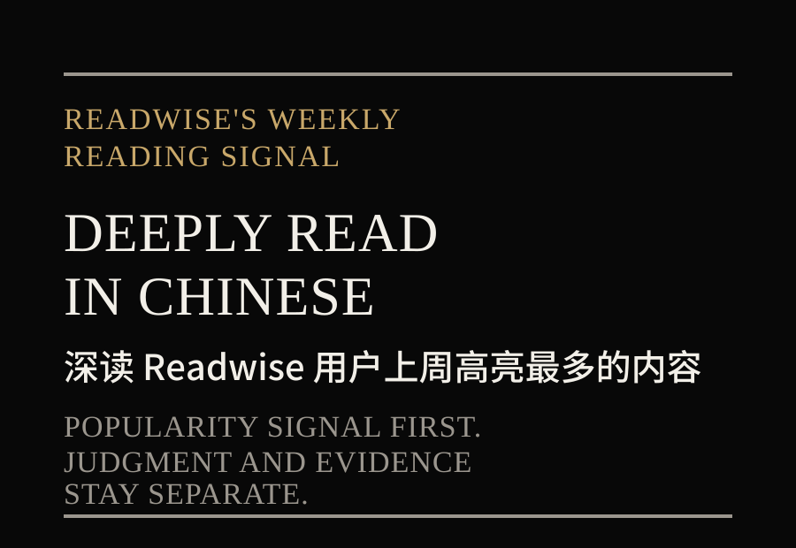
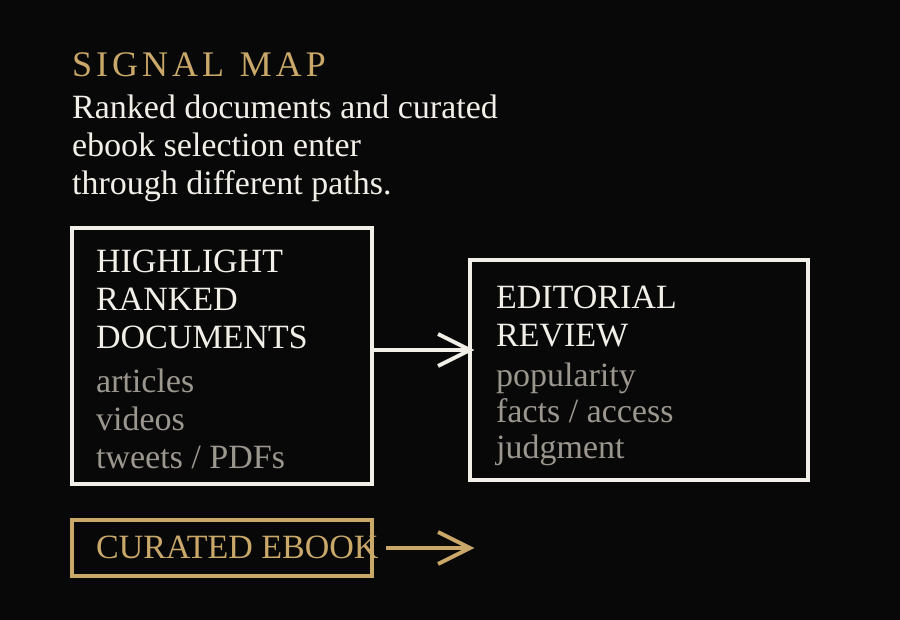
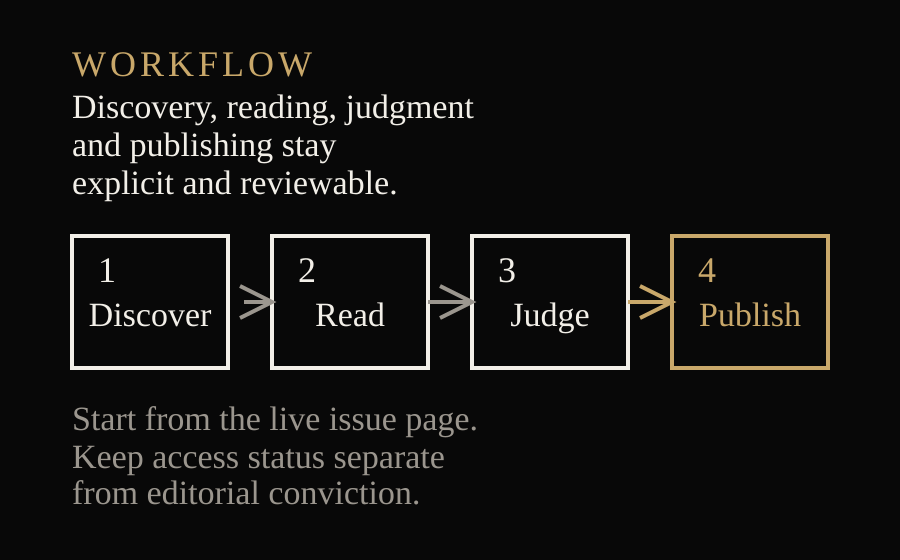
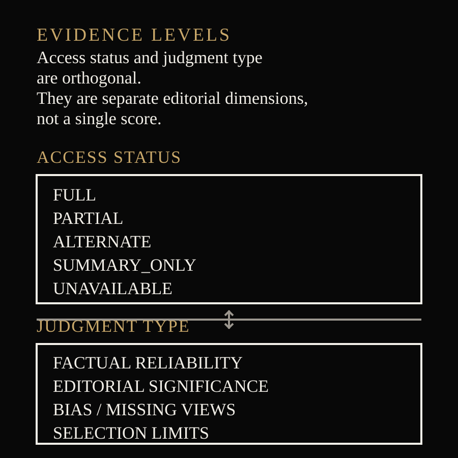

# Weekly Wisereads

> **独立、非官方项目。** 本项目不隶属于 Readwise；由极客杰尼发起，以中文保存每期值得长期重读的判断。

**深读 Readwise 用户上周高亮最多的内容，从集体阅读信号中，提炼值得理解、质疑与长期保留的观点。**

Weekly Wisereads 不是 AI 周报。主题由当期内容决定；AI / Agent / 工程只是可选分析镜头，不设内容配额。

## Latest Issue

<!-- AUTO:LATEST:START -->
- [Vol. 156｜Wisereads Vol. 156 深度解读：当答案变便宜，能力、意义与制衡更稀缺](reports/2026/2026-08-20-vol-156.md)
<!-- AUTO:LATEST:END -->

## What Is Weekly Wisereads

[Weekly Wisereads](https://wise.readwise.io/) 是 Readwise 对上一周集体阅读注意力的公开切片：

- 文章、视频、tweets / threads 与公开 PDF，按上一周的独立高亮用户数排序；
- 电子书由 Readwise 单独策划或合作纳入，不属于同一排名机制；
- 当期还可能出现页面明确标注的其他策划内容。

热门不等于正确，也不等于质量更高。这个信号还受到 Readwise 用户构成、语言、媒介、职业、地域和公开可访问性的共同影响。

## Why

高亮榜单擅长告诉我们“人们在保存什么”，却不会自动回答：

- 作者真正的论证链是什么；
- 哪些是事实、观点、项目推断或待验证判断；
- 为什么它可能被大量高亮；
- 热度与独立质量判断是否一致；
- 谁的声音没有进入样本；
- 哪些观点值得进入工作、财富、人生与长期决策。

本项目把一周的注意力，转化为可审查、可纠错、可长期归档的中文阅读产品。

## What You Get

每期报告提供：

- 30 秒结论与 15–20 分钟分层阅读；
- 从当期全部条目生成的主题，而不是预设赛道；
- 重点文章的论证、假设、反例与独立判断；
- AI / Agent / 工程、产品、商业、财富、工作与人生等实际出现的分析镜头；
- 全部条目证据卡、访问降级与覆盖统计；
- Readwise 用户样本偏差、缺席视角与选择机制边界；
- 有材料支撑的行动建议与机会观察。

## How It Works

1. 每次从 https://wise.readwise.io/ 首页读取第一张期刊卡，不写死最新一期 URL；
2. 以期号为主、日期为辅，扫描已有 Front Matter 去重；
3. 冻结详情页全部独立条目的元数据清单；
4. 每个条目独立深读并生成一张 SourceCard；
5. 全部条目进入终态后，才做跨来源综合；
6. 运行报告、仓库、幂等与并发门禁；
7. 原子更新报告、最新区块和完整归档。

任何身份冲突、结构漂移、覆盖率不足或并发更新都会停止发布，不猜测、不覆盖。

## Featured Insights

首期黄金样板 Vol.155 显示了这套方法的价值：

- 当 Agent 提高执行吞吐，工作图谱、记忆、边界、评审与恢复会成为一等工程对象；
- LLM 抬高通才下限，但领域专家仍靠异常识别、具体背景与结果验收放大同一模型；
- Shape Up 最可迁移的不是“六周”，而是 appetite、风险前置、可变范围和 circuit breaker；
- 工作自由、长期休假与失败恢复共同把自由重新定义为“能够不继续”；
- 审美可以成为产品约束与研究议程，但不能取代事实、无障碍与多元偏好。

## Archive

<!-- AUTO:RECENT:START -->
- [Vol. 156｜Wisereads Vol. 156 深度解读：当答案变便宜，能力、意义与制衡更稀缺](reports/2026/2026-08-20-vol-156.md)
- [Vol. 155｜Wisereads Vol. 155 深度解读：当执行变便宜，判断与选择权变得更贵](reports/2026/2026-08-12-vol-155.md)

- [完整归档](reports/README.md)
<!-- AUTO:RECENT:END -->

## Use the Skill

仓库同时提供内容方法与可安装 Skill：[skills/weekly-wisereads/SKILL.md](skills/weekly-wisereads/SKILL.md)。

安装或保存后，在 Work / Codex 中使用：

    $weekly-wisereads

定时任务只负责调度；Skill 定义首页发现、身份去重、全量深读、证据分级、质量门禁、原子发布与运行摘要。

## Methodology

我们严格区分两个正交维度：

- **访问状态**：FULL、PARTIAL、ALTERNATE、SUMMARY_ONLY、UNAVAILABLE；
- **判断类型**：已证实、作者观点、项目推断、待验证。

FULL 不保证作者正确；ALTERNATE 也不会被冒充为原文完整读取。完整方法见 [方法参考](skills/weekly-wisereads/references/)。

## Contributing

欢迎事实纠错、一手来源、反方材料、方法改进、Skill / 模板修复与可复现测试。请阅读 [CONTRIBUTING.md](CONTRIBUTING.md)，或提交 [Correction request](.github/ISSUE_TEMPLATE/correction.yml)。

我们不接受源全文镜像、无来源断言、推广内容或未实际阅读的批量 AI 报告。不同意结论本身不是删除来源的理由；证据质量与热度始终分开审查。

## About

Weekly Wisereads 是一个独立开源的中文深读档案，由极客杰尼发起。

项目关注的不是追热点速度，而是把集体阅读信号变成可以理解、质疑、修正并长期保留的公共知识资产。

- 来源站点：[Weekly Wisereads](https://wise.readwise.io/)
- 许可：[MIT](LICENSE)
- 完整归档：[reports/README.md](reports/README.md)
