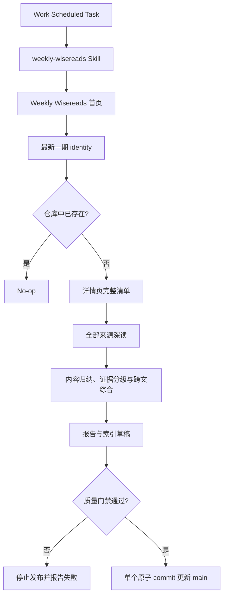
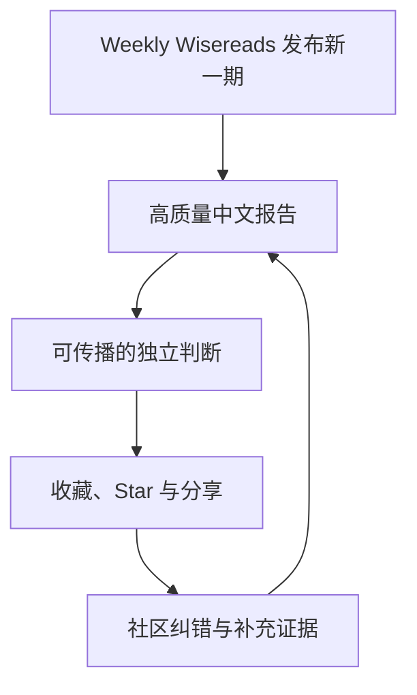

# Weekly Wisereads：每周高亮内容的中文深读与思想档案设计

> 状态：设计基线已确认；来源定位与跨文档一致性审查已完成，等待同步 GitHub 并进入实施计划  
> 日期：2026-08-12  
> 发起人：极客杰尼  
> 仓库：[geekjourneyx/weekly-wisereads](https://github.com/geekjourneyx/weekly-wisereads)

## 1. 执行摘要

Weekly Wisereads 是 Readwise 发布的周报。网页文章、YouTube 视频、tweets 与公开保存的 PDF，按照上一周的独立高亮用户数排序；电子书则由 Readwise 策划公开可用的非 DRM EPUB，或通过与自出版作者、出版作者合作纳入。

本项目不是 AI 周报，而是 Weekly Wisereads 的独立中文深读与思想档案。系统每周访问 [Weekly Wisereads 首页](https://wise.readwise.io/)，发现最新一期，进入详情页枚举全部内容，再逐项深读实际出现的来源。完成全量阅读后，生成一份 15–20 分钟可读完的中文报告，回答：

- 这一周 Readwise 用户的集体阅读注意力落在哪里；
- 每篇内容真正讲了什么，论证是否成立；
- 不同内容之间有哪些共识、冲突与缺席视角；
- 哪些观点值得长期保留、质疑或用于行动；
- 若本期实际存在，哪些内容对 AI / Agent / Harness / 工程、产品、商业与创业有启发。

内容本身决定主题。AI 与专业机会只是可选分析镜头，不设数量配额，也不是每期交付承诺。本期没有显著 AI 内容时，报告必须明确说明，不得凑栏目或把通用文章强行改写成 AI 资讯。

系统采用 **Skill-first 内容产品** 架构：

- Work Scheduled Task 只负责何时运行；
- 仓库内的 Skill 定义如何发现、阅读、分析、验证和发布；
- GitHub 仓库保存规则、状态与最终报告，是唯一持久事实源；
- 质量门禁通过后，报告和索引通过一个原子 commit 直接写入 `main`。

首版先将 Vol.155 制作为黄金样板。只有发现、全量覆盖、证据分级、报告质量、README 更新、幂等运行与异常测试全部通过，才创建正式的每周定时任务。

本项目不是 Readwise 官方项目，不保存或镜像来源全文，只发布原创中文分析、必要短引用和来源链接。

## 2. 目标

### 2.1 用户目标

让希望跟踪 Readwise 集体阅读与高亮信号的中文深度读者、知识工作者与创作者在 15–20 分钟内：

1. 看懂 Weekly Wisereads 本期实际收录了什么，以及集体注意力集中在哪些主题；
2. 理解重点内容的核心命题、论证链、证据、边界和反方解释；
3. 区分“Readwise 用户中高亮较多”与“客观上最好、最重要或最真实”；
4. 区分事实、作者观点、项目推断和待验证假设；
5. 发现关于人生、工作、财富、生活及其他领域中值得长期保留和反复思考的观点；
6. 在材料确实支持时，识别 AI、Agent、工程、产品、商业和创业机会。

### 2.2 产品目标

1. 每周稳定产出一份高质量、可搜索、可引用的中文研究档案；
2. 把分析方法沉淀成可安装、可复用的 Skill；
3. 用证据透明度和偏差自觉建立区别于普通摘要项目的信任；
4. 形成“新一期 → 深度报告 → 分享 → Star / 纠错 → 更高质量报告”的增长飞轮；
5. 以真实内容质量、README 门面和持续更新冲击 1k GitHub Stars。

内容产品采用“一个基础层、两个可选镜头”：

- **基础层**：忠实覆盖本期全部内容，识别实际主题、集体阅读信号、论证质量与选择偏差；
- **专业与机会镜头**：仅在材料支持时分析 AI、Agent、Harness、工程、产品、商业、产业与创业；
- **长期思考镜头**：仅在材料支持时识别人生选择、工作意义、财富观、生活方式及其他具有长期解释力的观点。

任一镜头都允许本期无显著发现。完整覆盖不等于每个预设主题都必须有内容。

### 2.3 工程目标

1. 不写死期号与详情页 URL；
2. 任务重复运行不会产生重复报告；
3. 报告、根 README 和归档索引不会部分更新；
4. 来源受限时允许透明降级，关键上下文缺失时停止发布；
5. 页面结构、来源访问和 GitHub 并发变化发生异常时安全退出。

## 3. 非目标

- 不镜像、转载或长期保存 Weekly Wisereads 与原始来源全文；
- 不使用用户私人 Readwise 账号或 Reader 数据；
- 不自动发布公众号、X、Slack 或其他外部平台；
- 不自动创建 GitHub Issue、PR、Release 或 Discussions；
- 不为每篇内容平均分配篇幅；
- 不为了栏目完整而虚构商业机会；
- 首版不回填全部 155 期历史报告；
- 首版不提供中英双语报告；
- 首版不使用 GitHub Actions 作为主调度器；
- 首版不引入数据库、外部状态服务或独立 `state.json`；
- 首版不建设完整的通用自动化框架。

## 4. 已确认的产品决定

| 决定 | 已确认选择 |
| --- | --- |
| 执行载体 | Work 独立 Scheduled Task |
| 运行时间 | 北京时间每周一 10:00 |
| 研究范围 | 全部来源深读，包括正文、字幕、tweets / threads、PDF 与电子书 |
| 来源定位 | 上周按独立高亮用户数排序的文档，加上单独策划或合作纳入的电子书；不是 AI 周报 |
| 目标读者 | 希望跟踪 Readwise 集体阅读与高亮信号的中文深度读者、知识工作者与创作者 |
| 主题原则 | 内容先行；AI / 产品 / 商业等均为可选分析镜头，不设配额 |
| 发布方式 | 质量门禁通过后直接写入 `main` |
| 状态主键 | `issue_key` 为主，`source_url` 交叉校验，日期用于排序 |
| 来源受限 | 降级分析并明确标记证据等级 |
| 报告体验 | 15–20 分钟分层阅读 |
| 冷启动 | 先制作 Vol.155 黄金样板 |
| README | 稳定首页，只自动更新最新一期与近期归档 |
| 视觉方向 | 黑底、暖金、现代编辑杂志 |
| 品牌 | 独立项目，由极客杰尼发起 |
| 会话形态 | 每次独立运行，状态和规则均从 GitHub 读取 |
| 产品架构 | Skill-first 内容产品 |

## 5. 已查证事实与未验证假设

### 5.1 已查证事实

- `geekjourneyx/weekly-wisereads` 在设计开始时为空仓库；
- Weekly Wisereads 的网页文章、YouTube 视频、tweets 与公开保存的 PDF 按上一周独立高亮用户数排序；
- 电子书采用不同选择机制：Readwise 策划公开可用的非 DRM EPUB，或与自出版作者、出版作者合作纳入；
- 该排序反映 Readwise 用户群体的集体阅读与高亮信号，不等同于个性化推荐、客观质量排名、完整议题覆盖或包容性样本；
- Readwise 的官方解释认为，“实际阅读并高亮”这一行为通常能为普通 Readwise 用户筛出相对高质量、有趣的内容；本项目将其视为有价值的发现先验，而不是质量结论；
- Weekly Wisereads 首页按最新到最旧列出 issue；
- 2026-08-12 检查时，首页最新一期为 Vol.155；
- Work Scheduled Task 可以使用 Skills 与插件；
- 网页端 Scheduled Task 不保留可依赖的本地工作目录；
- GitHub 插件支持读取仓库及创建 blob、tree、commit 和更新 ref。

有关 Scheduled Task 的运行边界参考 [OpenAI Scheduled Tasks 文档](https://learn.chatgpt.com/docs/automations)。

### 5.2 未验证假设

- 每周一 10:00 时 Weekly Wisereads 通常已发布新一期；
- Scheduled 环境中的 GitHub 权限允许无人值守更新目标仓库 `main`；
- 大部分来源能够读取完整内容或找到可信的一手替代来源；
- `FULL + ALTERNATE >= 50%` 适合作为首版发布覆盖率警戒线；
- 15–20 分钟可以兼顾全部条目覆盖、深度和传播效率。

这些假设必须通过 Vol.155 黄金样板和前三次真实运行校准。

### 5.3 来源解释边界

项目可以从榜单推断“哪些内容在 Readwise 用户中获得了较多高亮”，但不能据此直接推断：

- 这是全网本周最好或最重要的内容；
- 高亮多等于论证正确、事实可靠或值得赞同；
- Readwise 用户能够代表所有读者或社会整体；
- 榜单未收录的主题不重要；
- 某篇内容的精确独立高亮人数，除非公开页面明确提供了该数字。

每期报告必须主动讨论选择偏差与缺席视角，把“流行度信号”和“质量判断”分开书写。

### 5.4 定位不变量

README、Skill、报告模板、每期报告与 Scheduled Prompt 必须同时满足：

1. **来源定义不漂移**：Weekly Wisereads 是 Readwise 用户上一周的集体高亮信号，不是 AI 周报；电子书明确属于独立策划或合作机制。
2. **主题由内容生成**：科技、历史、心理、工作、财富、人生或其他领域都有可能成为当期主题，禁止预设主赛道。
3. **AI 只是可选镜头**：AI / Agent / Harness / 工程不设内容配额，不进入项目的主分类、仓库描述或固定搜索 Topics。
4. **缺席也是正常结果**：没有相关内容时，明确写“本期无显著 AI / Agent / 工程信号”，不凑栏目、不强行关联。
5. **热度不等于质量**：始终区分独立高亮用户数、项目质量判断、事实可靠性与普遍代表性，并指出用户样本偏差和缺席视角。

## 6. 系统架构



### 6.1 Scheduled Task

职责：

- 北京时间每周一 10:00 触发；
- 启动独立运行；
- 调用 GitHub 插件、网页读取能力与项目 Skill；
- 返回运行摘要、失败阶段或 commit URL。

Scheduled Task 不承担：

- 保存历史状态；
- 内嵌完整分析方法；
- 推断最新期号；
- 在质量门禁失败后继续写仓库。

### 6.2 `weekly-wisereads` Skill

职责：

- 发现最新一期；
- 建立条目清单；
- 执行来源阅读与降级策略；
- 从实际内容识别主题，不按预设领域凑数；
- 建立分析卡，区分流行度信号与质量判断并进行跨文章综合；
- 生成报告；
- 运行质量门禁；
- 生成受控的 README 与索引更新；
- 执行原子写入与提交后验证。

### 6.3 GitHub 仓库

职责：

- 保存 Skill 和方法论；
- 保存每期原创报告；
- 通过报告 Front Matter 保存期号、来源 URL 与运行元数据；
- 提供稳定品牌首页与完整归档；
- 作为去重和幂等判断的唯一持久事实源。

## 7. 最新一期发现与幂等规则

### 7.1 发现流程

每次运行必须：

1. 访问 `https://wise.readwise.io/`；
2. 读取首页第一条最新 issue；
3. 提取标题、普通 Vol 或 Special Edition 标识、详情页 URL；
4. 进入详情页确认 identity 和内容清单；
5. 禁止根据上期数字猜测下一期；
6. 禁止自行拼接详情页 URL；
7. 禁止默认 Weekly Wisereads 每周一定按时更新。

### 7.2 `issue_key`

普通期：

```text
wisereads-vol-155
```

特别刊：

```text
wisereads-special-vol-2
```

实际格式以 Weekly Wisereads 页面 identity 为依据，并在 Skill 中做规范化。

### 7.3 去重顺序

1. 搜索报告 Front Matter 中是否存在相同 `issue_key`；
2. 搜索是否存在相同 `source_url`；
3. 任一命中即视为已处理；
4. 已处理时正常 no-op，不创建文件、不更新 README；
5. 不维护独立状态文件，避免状态与报告双写不一致。

## 8. 仓库结构

```text
weekly-wisereads/
├── README.md
├── AGENTS.md
├── LICENSE
├── CONTRIBUTING.md
├── assets/
│   └── readme/
│       ├── hero.svg
│       ├── workflow.svg
│       ├── signal-map.svg
│       ├── evidence-levels.svg
│       └── section-*.svg
├── skills/
│   └── weekly-wisereads/
│       ├── SKILL.md
│       └── references/
│           ├── positioning-contract.md
│           ├── report-template.md
│           ├── evidence-policy.md
│           ├── quality-gates.md
│           └── readme-update-contract.md
├── reports/
│   ├── README.md
│   └── 2026/
│       └── 2026-08-12-vol-155.md
└── docs/
    └── design/
        └── 2026-08-12-weekly-wisereads-design.md
```

### 8.1 文件职责

| 路径 | 职责 |
| --- | --- |
| `README.md` | 品牌首页、最新一期、近期归档、使用与方法说明 |
| `AGENTS.md` | Agent 执行边界、验证命令和禁止事项 |
| `skills/weekly-wisereads/SKILL.md` | 权威执行流程与决策规则 |
| `skills/weekly-wisereads/references/positioning-contract.md` | 五条定位不变量与禁止表述，是 README、报告和 Prompt 的共同语义契约 |
| `skills/weekly-wisereads/references/` | 报告模板、证据规则、门禁与 README 更新契约 |
| `reports/YYYY/` | 每期完整中文报告 |
| `reports/README.md` | 全部历史期数索引 |
| `assets/readme/` | 可维护、GitHub 安全的确定性视觉资产 |

## 9. 报告文件与数据模型

### 9.1 文件命名

```text
reports/<year>/<北京时间首次发现日期>-vol-<期号>.md
reports/<year>/<北京时间首次发现日期>-special-vol-<期号>.md
```

示例：

```text
reports/2026/2026-08-12-vol-155.md
reports/2026/2026-09-02-special-vol-2.md
```

日期表示首次发现日期，不承担唯一身份职责。

### 9.2 Front Matter

```yaml
---
title: "Wisereads Vol. 155 深度解读"
issue_key: "wisereads-vol-155"
issue_kind: "standard"
issue_number: 155
issue_label: "Vol. 155"
source_url: "https://wise.readwise.io/issues/wisereads-vol-155/"
discovered_at: "2026-08-12T10:00:00+08:00"
generated_at: "2026-08-12T10:42:00+08:00"
language: "zh-CN"
reading_time_minutes: 18
sources_total: 10
sources_full_read: 8
sources_degraded: 2
---
```

`issue_kind` 只允许 `standard` 或 `special`；`issue_number` 始终为整数；`issue_label` 保存页面中的完整期号显示文本。特别刊示例：

```yaml
issue_key: "wisereads-special-vol-2"
issue_kind: "special"
issue_number: 2
issue_label: "Special Edition Vol. 2"
```

## 10. 来源获取与分析流程

### 10.1 建立完整 inventory

从详情页枚举所有可被读者视为独立推荐项的内容：

- 网页文章；
- YouTube 视频；
- tweets 或 threads；
- 公开保存的 PDF；
- 公开非 DRM EPUB，或 Readwise 与作者、出版方合作纳入的电子书；
- 详情页未来增加的其他内容类型。

每项记录：

- 原始标题；
- 作者或发布者；
- 原始 URL；
- 内容类型；
- 在详情页中的顺序；
- 访问状态；
- 替代来源 URL（如有）。

### 10.2 逐篇分析卡

所有条目先独立完成内部分析卡：

- 核心命题；
- 作者的论证链；
- 关键证据；
- 隐含前提；
- 可能的反方解释；
- 为什么它可能被许多 Readwise 用户高亮（明确标注为项目推断）；
- 它的受欢迎程度与论证质量是否一致；
- 与本期实际主题的关系；
- 与专业机会或长期思考镜头的关系（如有）；
- 与其他文章互相印证或冲突之处；
- 对产品、工程、商业、创业或真实生活的启发（如有）；
- 适合进入最终报告的结论与行动。

分析卡属于运行中的中间结构，首版不长期保存原文内容或完整内部笔记。

### 10.3 跨文章综合

只有全部条目处理完成后，才执行：

1. 主题聚类；
2. 集体阅读注意力与可能高亮动机识别；
3. 共同驱动力识别；
4. 观点冲突识别；
5. 选择偏差与缺席视角分析；
6. 重点文章选择；
7. 专业与商业机会提炼（如有）；
8. 长期思考观点提炼（如有）；
9. 最终报告编排。

这样避免被第一篇文章锚定，也避免把报告写成逐篇摘要列表。

## 11. 证据与访问分级

访问完整度与结论可信度分开表达。

### 11.1 访问状态

| 标记 | 定义 | 允许的写法 |
| --- | --- | --- |
| `FULL` | 完整读取原文、PDF或可用字幕 | 可以分析完整论证链 |
| `PARTIAL` | 只获得正文部分、节选或不完整字幕 | 只能对已看到内容下结论 |
| `ALTERNATE` | 原链接受限，但读取作者公开版本或同一内容的一手替代来源 | 同时标明原链接和替代来源 |
| `SUMMARY_ONLY` | 仅能读取 Weekly Wisereads 摘要 | 只能表述为摘要层信息 |
| `UNAVAILABLE` | 无法获得足够内容 | 保留条目和失败原因，不生成虚构摘要 |

### 11.2 判断类型

- **已证实**：原文或其他一手来源直接支持；
- **作者观点**：属于作者判断，不写成客观事实；
- **项目推断**：由本项目跨来源推导，说明依据；
- **待验证**：有启发，但证据不足或存在明显反方解释。

## 12. 报告信息架构

```text
# Wisereads Vol. N 深度解读

元信息与覆盖率

## 30 秒看懂本期
## 本周集体阅读信号
## 本期最值得理解的判断
## 本期最值得反复思考的观点
## 重点文章深拆
## 专业与机会观察（如有）
## 全部条目阅读笔记
## 这份榜单没有告诉我们的
## 本期行动建议
## 来源与证据说明
```

### 12.1 30 秒看懂本期

- 一句话总判断；
- 本期实际出现的主要主题；
- 项目编辑判断中最值得立即阅读的内容，最多三篇；
- 对不同类型读者的直接价值；
- 是否存在显著的 AI / Agent / 工程、产品、商业或创业内容；
- 一个最值得带走继续思考的问题。

### 12.2 本周集体阅读信号

这一节先描述本期实际内容，不套用固定行业分类：

- 哪些主题、媒介和作者占据了 Readwise 用户的集体注意力；
- 不同条目之间形成了哪些聚类、共识与冲突；
- 用户可能为何高亮这些内容，此项只能标注为项目推断；
- 哪些主题明显缺席，Readwise 用户构成可能带来什么偏差；
- 流行度信号与项目自己的质量判断是否一致。

完成内容归纳后，才应用两个可选镜头：

- **专业与机会镜头**：AI / Agent / Harness / 工程、产品、商业模式 / 增长 / 定价、产业与创业；
- **长期思考镜头**：人生、工作、财富、生活方式、关系、注意力、创造、意义及其他具有长期解释力的观点。

两个镜头均不设配额。本期没有显著 AI 内容时明确写“本期无显著 AI / Agent / 工程信号”；没有强商业机会或长期观点时也如实说明，不凑数。非 AI 内容根据其自身思想质量、解释力和真实影响独立判断。

### 12.3 重要判断

重要判断优先跨文章综合：

- 发生了什么；
- 为什么现在发生；
- 底层驱动力；
- 哪些来源互相印证或冲突；
- 对读者理解、决策或生活的影响；
- 对产品、工程和创业的影响（如有）；
- 本项目的判断与不确定性。

### 12.4 重点文章深拆

根据价值选择 3–5 篇，不固定凑数。每篇包含：

- 核心命题；
- 作者论证链；
- 最有价值的证据；
- 底层原理；
- 反直觉之处；
- 被忽略的前提与反方观点；
- 对目标读者的启发，包括专业决策或真实生活；
- 可以采取的具体行动或继续思考的问题。

### 12.5 本期最值得反复思考的观点

从全部来源中识别 3–5 个最具长期价值的观点，允许来自人生、工作、财富、生活、关系、注意力、创造和意义等领域。每个观点回答：

- 原文真正提出了什么；
- 它触及了哪种普遍处境或核心冲突；
- 为什么这个观点值得在本周之后继续保留；
- 哪些前提、反例或边界可能削弱它；
- 它会如何改变一个人的选择、工作方式或生活方式；
- 可以带走继续思考的一个问题。

本栏目以思想质量为准，不按主题凑数。若本期没有达到标准的观点，应明确说明，不从普通金句中强行制造深度。

### 12.6 专业与机会观察

只有本期材料确实支持时才建立这一节。可覆盖 AI / Agent / Harness / 工程、产品、商业、增长、定价、产业与创业，不要求每期或每个类别都有发现。

每条真实机会必须包含：

- 用户痛点；
- 机会窗口；
- 可产品化方向；
- 可能的付费者与付费动机；
- 分发和增长路径；
- 最大风险；
- 最小验证动作。

没有显著 AI 内容时明确写“本期无显著 AI / Agent / 工程信号”；没有强机会时明确写“本期未发现强机会”。二者均为正常结果，不降低报告完整度。

### 12.7 全部条目阅读笔记

周报中的每个条目必须出现，并包含：

- 标题、作者和链接；
- 一句话结论；
- 关键观点；
- 值得读的原因；
- 可能的高亮原因（项目推断）；
- 项目的质量判断与理由；
- 本期实际主题标签；
- 与专业机会或长期思考镜头的关系（如有；也允许均不属于）；
- 访问状态和必要的降级说明。

### 12.8 这份榜单没有告诉我们的

每期必须用简短一节说明：

- 该榜单反映的是 Readwise 用户群体，不代表所有读者；
- 该榜单是群体热度排序，不是针对当前读者兴趣与目标生成的个性化推荐；
- “被更多人高亮”不等于事实更真、论证更强或观点更值得赞同；
- 本期可能被过度代表与低估的主题、地区、身份、媒介或声音；
- 公开页面未提供的数据不得推测为精确事实；
- 哪些重要问题需要榜单外材料才能形成更平衡的判断。

## 13. 编辑优先级

不使用伪精确的综合分数，采用三级编辑判断：

| 等级 | 定义 |
| --- | --- |
| 必读 | 论证、证据或思想价值足以显著改变理解、决策或生活判断 |
| 值得读 | 有可靠洞察，但影响较间接或适用范围较窄 |
| 延伸阅读 | 完整收录，适合特定兴趣或长期背景积累 |

判断综合考虑：

- 与本期核心主题及读者真实问题的相关性；
- 观点新颖度；
- 证据质量；
- 可行动性；
- 判断的长期有效性。

高亮热度不直接决定编辑等级；它只解释内容为何进入 Weekly Wisereads，项目仍需独立判断其质量与价值。

## 14. 质量门禁

### 14.1 硬门禁

| 门禁 | 通过条件 | 失败行为 |
| --- | --- | --- |
| 最新期识别 | 从首页得到可验证的最新 identity 和详情 URL | 不写入 |
| 去重检查 | `issue_key` 和 `source_url` 均未命中已有报告 | 命中则 no-op |
| 详情页完整性 | 能够解析完整条目清单 | 不写入 |
| 条目覆盖 | 清单中每个条目都在报告中出现 | 不写入 |
| 证据标记 | 每个条目都有访问状态，事实与推断可区分 | 不写入 |
| 文档完整性 | Front Matter、固定栏目、链接和自动标记合法 | 不写入 |
| 来源覆盖率 | `FULL + ALTERNATE >= 50%` | 生成失败报告，不公开发布 |
| 原子写入 | 所有目标文件可组成同一 commit | 禁止部分更新 |

50% 是首版警戒线，不是永久标准。Vol.155 与前三次真实运行后允许调整。

### 14.2 内容校验

- 详情页条目数等于报告收录条目数；
- 每个原始链接只对应一个分析条目；
- `PARTIAL` 以下来源不能被写成完整原文结论；
- 不允许 `TODO`、`TBD`、占位符、虚构数字和无链接引用；
- 必须准确说明网页文章、YouTube 视频、tweets 与公开保存的 PDF 按上一周独立高亮用户数排序，并单独说明电子书的策划或合作机制；
- 不得把“高亮较多”写成“全网最好”“本周最重要”或“客观正确”；
- 未公开独立高亮人数时不得编造或估算精确数字；
- 必须包含 30 秒摘要、集体阅读信号、重点判断、全部阅读笔记、选择偏差和来源说明；
- 主题标签必须来自本期实际内容，不能为 AI、商业或任何预设栏目凑数；
- 若本期没有显著 AI / Agent / 工程内容，必须明确说明，不得因此判定报告不完整；
- 必须识别实际存在的人生、工作、财富、生活等非 AI 深度观点，不得强行附会到 AI；
- 商业机会必须具备用户、付费动机、验证动作和风险；
- 检查过长引用，避免形成来源替代品；
- 中文自然、可读，避免逐句翻译、机械排比和模板化 AI 套话；
- 报告目标为 15–20 分钟阅读，长度只用于异常检测，不允许靠灌水满足字数。

## 15. 失败处理

| 场景 | 行为 |
| --- | --- |
| Weekly Wisereads 首页不可访问 | 停止，返回发现阶段失败 |
| 首页结构变化 | 不猜测期号或 URL，停止 |
| 最新一期已处理 | 正常 no-op |
| 详情页不可访问 | 停止，不能确认完整 inventory |
| 单篇原文受限 | 尝试一手替代来源，标记降级后继续 |
| 视频没有字幕 | 查找作者文字稿；否则降级 |
| 完整/替代来源低于 50% | 不公开发布，返回覆盖率风险 |
| README 自动标记缺失 | 不提交任何文件 |
| `main` 在运行中变化 | 重新读取、重新去重并安全重试一次 |
| GitHub 写入失败 | 整体失败，不留下半成品 |
| 提交后验证失败 | 报告异常并保留 commit，不自动改写历史 |

## 16. 原子写入协议

1. 读取当前 `main` commit 和 tree；
2. 在内存中生成最终报告、根 README 与报告索引；
3. 对全部目标内容执行质量校验；
4. 创建目标 blobs；
5. 基于当前 tree 创建一个新 tree；
6. 创建一个父提交为原 `main` 的新 commit；
7. 再次确认 `main` 未变化；
8. 只移动一次 `main` ref；
9. 重新读取目标文件，验证 `issue_key`、链接与 commit SHA。

禁止连续执行三个相互独立的 Contents API 更新，因为这会暴露部分成功状态。

## 17. README 内容架构

README 阅读顺序：

1. Hero：一句话理解项目；
2. Latest Issue：真实最新报告；
3. What Is Weekly Wisereads：官方来源定义与选择边界；
4. Why：为什么高亮热度仍需要深读、验证与偏差分析；
5. What You Get：集体阅读信号、逐篇深读、可选专业镜头、长期思考与证据边界；
6. How It Works：发现、深读、证据分级、中文报告；
7. Featured Insights：真实样板中的代表性判断；
8. Archive：近期报告与完整索引；
9. Use the Skill：安装与复用；
10. Methodology：证据、选择偏差和质量门禁；
11. Contributing：纠错、补充来源与方法改进；
12. About：独立项目，由极客杰尼发起。

Hero 推荐文案：

> **READWISE'S WEEKLY READING SIGNAL, DEEPLY READ IN CHINESE**  
> 深读 Readwise 用户上周高亮最多的内容  
> 从集体阅读信号中，提炼值得理解、质疑与长期保留的观点。

### 17.1 README 自动更新契约

```html
<!-- AUTO:LATEST:START -->
仅更新最新一期
<!-- AUTO:LATEST:END -->

<!-- AUTO:RECENT:START -->
仅更新最近 6 期
<!-- AUTO:RECENT:END -->
```

自动任务不得修改标记之外的品牌文案与视觉结构。

新报告、根 README 自动区块和 `reports/README.md` 必须在同一 commit 中更新。

## 18. README 视觉系统

方法参考 [beautify-github-readme](https://github.com/oil-oil/beautify-github-readme)，但视觉语言必须来自本项目，不套用通用模板。

| 元素 | 规范 |
| --- | --- |
| 背景 | `#080808` 近黑 |
| 主文字 | `#F2EFE8` 暖白 |
| 强调色 | `#C9A86A` 克制暖金 |
| 辅助色 | 低亮度灰 |
| 构图 | Editorial Grid、大标题、细分隔线、编号和期刊元信息 |
| 气质 | 编辑杂志、研究刊物、判断现场 |

禁止：

- AI 机器人或人物素材；
- 霓虹蓝紫科技渐变；
- 廉价仪表盘与电商视觉；
- 将整个 README 栅格化；
- 依赖 GitHub 会剥离的脚本、远程字体或复杂 CSS。

最终资产采用可维护的确定性 SVG：

```text
hero.svg
workflow.svg
signal-map.svg
evidence-levels.svg
section-*.svg
```

设计要求：

- 最新期号不写入静态 Hero；
- 正文、命令、链接和索引保留为 Markdown；
- 不使用 GIF；
- 所有 SVG 在约 900px GitHub 内容宽度和 360px 窄屏下验证；
- 所有图片具备语义化 alt text；
- 图片加载失败时，README 仍能独立说明项目价值和使用方式。

## 19. 开源增长设计

### 19.1 增长飞轮



### 19.2 三种增长抓手

- **内容抓手**：每期从实际内容中形成可独立传播的核心判断，不预设它必须属于 AI、商业或任何固定主题；
- **工具抓手**：读者可以安装 Skill，复用方法建立自己的研究流程；
- **信任抓手**：公开证据等级、降级来源、推断与反方观点。

### 19.3 首发内容包

- 编辑杂志风格 README；
- Vol.155 黄金样板；
- 可安装的 `weekly-wisereads` Skill；
- 透明的方法论、证据政策和质量门禁；
- 完整归档入口；
- 清晰贡献指南；
- 准确仓库描述与 Topics；
- 显著的非 Readwise 官方项目声明。

推荐仓库描述：

> A Chinese deep-reading archive of Weekly Wisereads, covering Readwise users' most-highlighted weekly documents and each issue's curated ebook selection.

推荐 Topics：

```text
wisereads
readwise
weekly-wisereads
deep-reading
reading
highlights
knowledge-management
newsletter
chinese
research
critical-thinking
reading-notes
digital-reading
```

### 19.4 社区参与边界

接受：

- 更正事实或引用；
- 补充可验证的一手来源；
- 改进证据分级和分析方法；
- 修复 Skill、模板和 README；
- 推荐遗漏的反方材料。

不接受：

- 复制原文全文；
- 无来源的观点堆砌；
- 纯推广链接；
- 未经阅读的 AI 批量报告。

## 20. Scheduled Task 配置

- 名称：`Weekly Wisereads 深度解读`
- 类型：独立 Scheduled Task
- 时区：`Asia/Shanghai`
- 首次执行：2026-08-17 10:00
- 频率：每周一 10:00
- 模式：精确时间

```ical
BEGIN:VEVENT
DTSTART:20260817T100000
RRULE:FREQ=WEEKLY;BYDAY=MO;BYHOUR=10;BYMINUTE=0
END:VEVENT
```

周一 10:00 尚未发布新一期时，本次正常 no-op，下一次仍按周一执行。

## 21. Scheduled Prompt

```text
执行 Weekly Wisereads 周报工作流。

权威规则：
1. 使用 GitHub 插件读取 geekjourneyx/weekly-wisereads。
2. 读取并严格遵循 skills/weekly-wisereads/SKILL.md 及其直接引用的 references 文件。
3. 仓库内容是唯一持久状态源，不依赖历史聊天记录。

发现阶段：
1. 每次必须先访问 https://wise.readwise.io/。
2. 从首页识别当前排在第一位的最新一期。
3. 提取最新一期的标题、Vol / Special Edition 标识和详情页 URL。
4. 禁止写死期号、禁止自行拼接详情页 URL、禁止默认每周一定更新。
5. 使用 issue_key 和 source_url 检查仓库中是否已经存在该期报告。
6. 如果已处理，停止写入并返回 no-op 结果。

研究阶段：
1. 进入最新一期详情页。
2. 枚举其中全部网页文章、YouTube 视频、tweets / threads、公开 PDF、电子书和未来新增内容类型。
3. 打开并深度阅读每个原始来源。
4. 对无法完整读取的来源，按照 evidence-policy.md 寻找一手替代来源并标记降级状态。
5. 不得把 Weekly Wisereads 摘要冒充原文，不得补写未看到的事实。
6. 先从本期实际内容归纳主题，再决定是否应用 AI、产品、商业或长期思考等分析镜头；不得按预设栏目寻找或制造内容。
7. 区分“独立高亮用户较多”这一流行度信号与项目对论证质量、事实可靠性和思想价值的独立判断。
8. 不得将 Weekly Wisereads 描述为 AI 周报，也不得把榜单描述为全网最好、最重要或具有普遍代表性的内容。
9. 未公开精确独立高亮人数时不得编造或估算数字。
10. 全部来源处理完成后，再做跨文章聚类、选择偏差分析和综合判断。

输出阶段：
1. 按 report-template.md 生成 15–20 分钟中文分层报告。
2. 首先呈现本期实际主题、集体阅读信号、跨文共识与冲突，不以 AI 或商业分类统领全期。
3. 可选应用两个分析镜头：
   - 专业与机会镜头：AI / Agent / Harness / 工程、产品、商业模式 / 增长 / 定价、产业与创业；
   - 长期思考镜头：人生、工作、财富、生活，以及其他值得长期反复思考的文章与观点。
4. 两个镜头均不设配额。本期没有显著 AI 内容时，明确写“本期无显著 AI / Agent / 工程信号”，不得凑栏目或强行附会。
5. 覆盖全部条目，但根据思想、证据和读者价值分配篇幅。
6. 区分事实、作者观点、项目推断和待验证假设。
7. 必须包含“这份榜单没有告诉我们的”，说明用户样本、热门排序和缺席声音带来的限制。
8. 不复制原文全文，不为了填栏目虚构商业机会或深度观点。

验证与写入：
1. 执行 quality-gates.md 中的全部发布前校验。
2. 校验失败时禁止修改仓库，只返回失败阶段、证据和建议。
3. 校验通过后，在同一个 Git commit 中新建本期报告、更新 reports/README.md、仅更新根 README.md 的受保护自动区块。
4. 直接写入 main，但禁止强制覆盖。
5. 如果 main 已变化，重新读取并再次去重，只允许安全重试一次。
6. 提交后重新读取文件，验证 issue_key、链接和 commit SHA。

每次运行最终返回：
- 是否发现新一期；
- 处理的期号和详情 URL；
- 来源总数及各访问等级数量；
- 重点判断摘要；
- 创建或更新的文件；
- Git commit URL；
- 所有降级来源和未解决风险。
```

## 22. 权限边界

允许：

- 访问公开 Weekly Wisereads 页面和原始来源；
- 读取 `geekjourneyx/weekly-wisereads`；
- 质量门禁通过后更新该仓库 `main`；
- 修改 `reports/**`；
- 修改根 README 的自动标记区块。

禁止：

- 删除或重命名历史报告；
- 修改 README 自动区块之外的稳定品牌内容；
- 创建 Issue、PR、Release 或 Discussions；
- 向其他仓库写入；
- 发布社交媒体、公众号或外部消息；
- 使用私人 Readwise 数据；
- 遇到失败时绕过门禁或强制更新分支。

## 23. Vol.155 黄金样板测试

1. **发现测试**：从首页正确发现 Vol.155，不使用写死 URL；
2. **清单测试**：提取详情页全部内容类型；
3. **深读测试**：每个条目都有访问状态和分析卡；
4. **报告测试**：生成完整 15–20 分钟中文报告；
5. **README 测试**：最新一期与归档区块正确更新；
6. **幂等测试**：再次运行不产生重复文件；
7. **降级测试**：模拟付费墙和失效链接；
8. **Special Edition 测试**：验证特殊期号命名与去重；
9. **结构变化测试**：首页解析失败时安全停止；
10. **并发冲突测试**：`main` 变化后重新检查并安全退出；
11. **可读性测试**：README 和报告在宽屏与窄屏下可读；
12. **引用检查**：没有大段转载或把推断伪装成原文事实；
13. **定位测试**：README 与报告准确说明独立高亮用户排序及电子书的不同选择机制，不把 Weekly Wisereads 描述成 AI 周报或全网最佳榜；
14. **无 AI 测试**：使用不含 AI 内容的 fixture，验证报告如实说明无显著 AI 信号且仍能完整发布；
15. **主题涌现测试**：报告主题来自 fixture 实际内容，不因模板预设而生成不存在的分类；
16. **偏差测试**：报告包含用户样本、非个性化排序、流行度与缺席视角的边界说明；
17. **热度与质量分离测试**：使用“排名靠前但论证薄弱”的 fixture，验证报告仍能给出负面或保留的独立质量判断；
18. **电子书机制测试**：验证 README、Skill 与报告不会把策划或合作纳入的电子书误写成按独立高亮用户数排序。

## 24. 上线顺序

1. 提交并复核本设计文档；
2. 编写逐文件、逐测试的实施计划；
3. 初始化仓库结构、Skill、模板和验证规则；
4. 完成编辑杂志 README 与 SVG；
5. 手工执行 Vol.155 黄金样板；
6. 检查完整报告、来源覆盖率和阅读体验；
7. 再次运行 Vol.155，验证幂等 no-op；
8. 模拟降级、Special Edition、README 标记缺失与并发冲突；
9. 修正 Skill 与模板；
10. 创建正式 Scheduled Task；
11. 手动触发一次任务，确认 GitHub 读写权限；
12. 观察前三次周度运行，再校准覆盖率和报告长度。

## 25. 剩余风险与缓解

| 风险 | 缓解措施 |
| --- | --- |
| Weekly Wisereads 页面结构变化 | 首页解析失败时停止；黄金样板保留发现测试 |
| 付费墙与登录墙 | 一手替代来源、证据分级与 50% 覆盖率门禁 |
| 直接写 `main` 放大错误 | 六道硬门禁、单 commit、提交后验证 |
| 周一 10:00 尚未更新 | 本次 no-op；前三次观察发布时间后再决定是否增加重试 |
| 项目被误认为官方 | README 首屏和 About 明确标注非官方 |
| 版权风险 | 不保存全文、限制引用、只发布原创分析和链接 |
| 自动摘要同质化 | 全量阅读、跨文综合、反方观点、项目推断与行动验证 |
| 定时任务暂停或权限失效 | Scheduled 运行摘要、首次手动触发、定期查看任务状态 |

## 26. 验收标准

首版完成必须同时满足：

- 仓库结构与本 Spec 一致；
- README 首屏在 10 秒内准确说明 Weekly Wisereads 的独立高亮用户排序及电子书策划机制，而不是把它描述成 AI 周报；
- README 说明群体热度、个性化、质量、真伪、代表性与包容性之间的边界；
- Vol.155 从首页发现并生成完整报告；
- Vol.155 报告覆盖详情页全部条目；
- 所有来源具有访问状态和证据边界；
- 报告先呈现本期实际主题和集体阅读信号，再按需应用专业机会与长期思考镜头；
- 报告包含选择偏差与缺席视角，不将高亮热度等同于客观质量；
- 排名靠前但证据薄弱的内容仍会得到独立的保留或负面质量判断；
- 无显著 AI / Agent / 工程内容的期数能正常生成，且明确说明这一结果；
- 非 AI 深度文章按自身价值分析，没有被牵强改写成 AI 观点；
- 报告达到 15–20 分钟分层阅读体验；
- 根 README 只通过受保护区块自动更新；
- 重复运行得到 no-op；
- 任一硬门禁失败不会改变 `main`；
- 报告与索引通过同一 commit 更新；
- Scheduled Task 在 `Asia/Shanghai` 每周一 10:00 运行；
- 每次运行返回新期状态、覆盖率、降级来源、目标文件和 commit URL。

## 27. 明确延期到后续版本

- 历史报告批量回填；
- 中英双语；
- GitHub Actions 版本；
- 自动生成 X / 公众号分发稿；
- 网站或搜索界面；
- 数值化文章评分；
- 社区 Discussions；
- 外部数据库或分析仪表盘；
- 多信息源扩展。

这些方向只有在 Vol.155 黄金样板和连续周度运行稳定后才重新评估。
