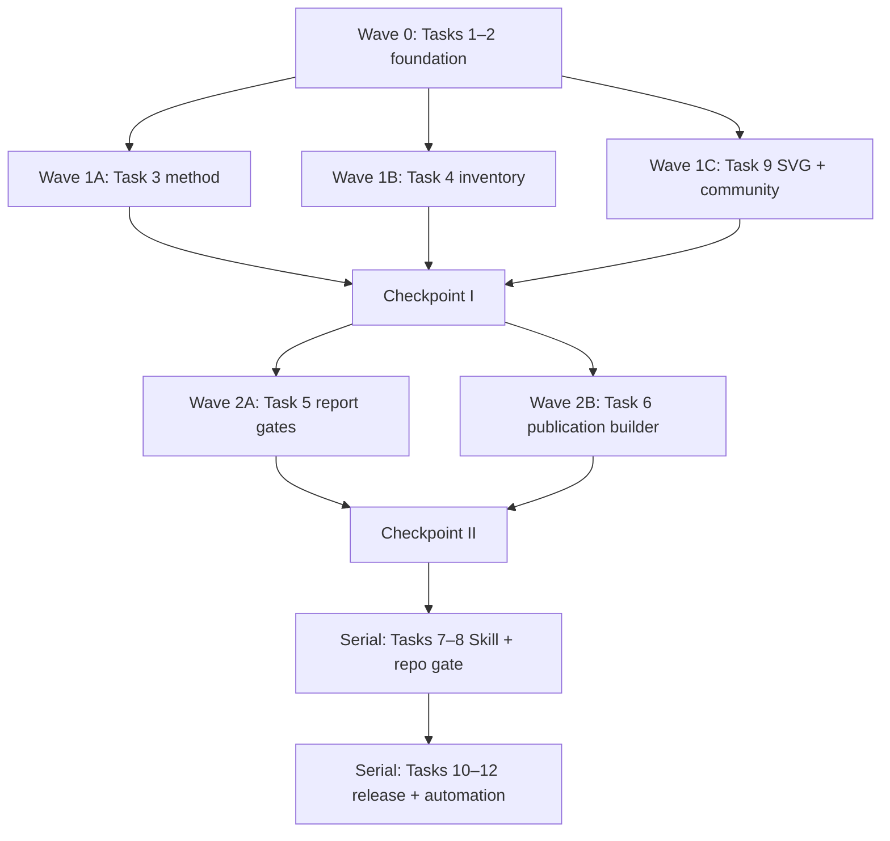

# Weekly Wisereads Skill-first Content Product Implementation Plan

> **For agentic workers:** REQUIRED SUB-SKILL: Use superpowers:subagent-driven-development (recommended) or superpowers:executing-plans to implement this plan task-by-task. Steps use checkbox (`- [ ]`) syntax for tracking.

**Goal:** Build an independently branded, repository-backed Chinese deep-reading archive that discovers the latest Weekly Wisereads issue, reads every listed source, separates popularity from quality, publishes one layered report, and safely updates `main` every Monday at 10:00 Asia/Shanghai.

**Architecture:** A Work Scheduled Task performs scheduling only. The installable `weekly-wisereads` Skill owns discovery, evidence handling, content-first synthesis, quality gates, and GitHub publication; the repository is the persistent source of truth for identity, reports, README state, and method. Deterministic Python scripts inside the Skill validate report contracts and build the three-file publication set, while GitHub blob/tree/commit/ref operations provide the final atomic write.

**Tech Stack:** Markdown, Agent Skills (`SKILL.md`, `agents/openai.yaml`, references and scripts), Python 3.11+, PyYAML 6.x, pytest 8.x, SVG 1.1, GitHub Git Data API, Work Scheduled Tasks, public web access.

## Global Constraints

- Weekly Wisereads is not an AI newsletter. Web articles, YouTube videos, tweets and publicly saved PDFs are ranked by unique highlighters from the previous week; the ebook uses Readwise curation or author/publisher partnership.
- The stable project positioning is exactly: `深读 Readwise 用户上周高亮最多的内容，从集体阅读信号中，提炼值得理解、质疑与长期保留的观点。`
- Topics emerge from the current issue. Technology, history, psychology, work, wealth, life and other fields are equally valid.
- AI / Agent / Harness / engineering is an optional analysis lens with no quota. If absent, write exactly `本期无显著 AI / Agent / 工程信号`.
- Every report separates popularity, evidence quality, factual reliability and editorial judgment, and includes selection bias and missing perspectives.
- Every run starts at `https://wise.readwise.io/`, reads the first/latest issue, then opens its detail page. Never guess the next volume or construct its URL.
- Deduplicate by `issue_key` first and `source_url` second. Do not create `state.json` or any second persistent state store.
- Publish directly to `main` only after every gate passes, and update the new report, `reports/README.md`, and the protected README blocks in one commit.
- Preserve stable README content outside `AUTO:LATEST` and `AUTO:RECENT` markers.
- Degraded sources are allowed only with explicit `FULL`, `PARTIAL`, `ALTERNATE`, `SUMMARY_ONLY`, or `UNAVAILABLE` status. `FULL + ALTERNATE` must be at least 50% for the first release.
- Do not mirror source text. Use original analysis, source links and short necessary quotations only.
- The first public report is Vol.155 and must serve as the golden sample before the Scheduled Task is enabled.
- The public report targets a 15–20 minute layered reading experience.
- Development uses feature branches and isolated worktrees. The direct-to-`main` rule applies to validated weekly publication runs, not concurrent development branches.

## File Map

| Path | Responsibility |
| --- | --- |
| `README.md` | Stable editorial homepage; only latest and recent blocks are machine-updated |
| `AGENTS.md` | Repository-wide agent boundaries, test commands and shared-file ownership |
| `LICENSE` | MIT license |
| `CONTRIBUTING.md` | Evidence corrections, source additions and method contributions |
| `pyproject.toml` | Python/test dependencies and pytest configuration |
| `assets/readme/hero.svg` | Stable black/ivory/warm-gold editorial hero |
| `assets/readme/signal-map.svg` | Separates highlight-ranked documents from the curated ebook path |
| `assets/readme/workflow.svg` | Discovery-to-publication workflow visual |
| `assets/readme/evidence-levels.svg` | Evidence and access-level visual |
| `skills/weekly-wisereads/SKILL.md` | Concise runtime procedure and reference routing |
| `skills/weekly-wisereads/agents/openai.yaml` | Human-facing skill name, description and default prompt |
| `skills/weekly-wisereads/references/positioning-contract.md` | Five non-negotiable positioning invariants and forbidden claims |
| `skills/weekly-wisereads/references/inventory-contract.md` | Issue and source-item schema, ordering, selection basis and terminal-state rules |
| `skills/weekly-wisereads/references/analysis-method.md` | Two-stage SourceCard then IssueSynthesis method for content-first themes |
| `skills/weekly-wisereads/references/report-template.md` | Exact report order, conditional sections and item-card schema |
| `skills/weekly-wisereads/references/evidence-policy.md` | Access statuses, judgment types, fallback order and quotation rules |
| `skills/weekly-wisereads/references/quality-gates.md` | Pre-publication gates and failure behavior |
| `skills/weekly-wisereads/references/readme-update-contract.md` | Protected marker rules and archive rendering contract |
| `skills/weekly-wisereads/references/atomic-publish-protocol.md` | Race-safe three-blob GitHub commit protocol and result states |
| `skills/weekly-wisereads/references/scheduled-prompt.md` | Canonical prompt copied into the Work Scheduled Task |
| `skills/weekly-wisereads/scripts/contracts.py` | Shared data types, front matter parsing and positioning checks |
| `skills/weekly-wisereads/scripts/validate_inventory.py` | Inventory ordering, URL, content type, selection basis and status validator |
| `skills/weekly-wisereads/scripts/validate_report.py` | Report-level deterministic validator and CLI |
| `skills/weekly-wisereads/scripts/build_publication.py` | Builds a validated three-file `PublicationPlan` without writing GitHub |
| `skills/weekly-wisereads/scripts/validate_repository.py` | Repository-wide gate runner and CLI |
| `reports/README.md` | Complete issue archive, newest first |
| `reports/2026/2026-08-12-vol-155.md` | Golden sample report |
| `tests/conftest.py` | Loads Skill scripts from the hyphenated directory and supplies fixtures |
| `tests/fixtures/valid-report.md` | Small valid report contract fixture |
| `tests/fixtures/no-ai-report.md` | Valid issue with no AI content and the required absence statement |
| `tests/fixtures/weak-popular-report.md` | Popular but weak-evidence item used to test independent quality judgment |
| `tests/fixtures/invalid-ebook-claim.md` | Fixture that incorrectly ranks the curated ebook by highlighters |
| `tests/fixtures/inventories/valid-all-types.json` | Complete article/video/tweet/PDF/ebook/other inventory |
| `tests/fixtures/inventories/invalid-duplicate-url.json` | Duplicate source-URL regression fixture |
| `tests/fixtures/inventories/invalid-ebook-selection.json` | Ebook incorrectly marked as highlight-ranked |
| `tests/fixtures/inventories/valid-special-edition.json` | Special Edition identity and filename regression fixture |
| `tests/fixtures/issues/vol-155/inventory.json` | Metadata-only golden inventory; contains no source text or analysis cards |
| `tests/test_contracts.py` | Front matter and positioning contract tests |
| `tests/test_method_references.py` | Inventory, evidence and two-stage synthesis documentation tests |
| `tests/test_inventory.py` | Inventory completeness, ordering, selection basis and terminal-state tests |
| `tests/test_report_validation.py` | Coverage, evidence, conditional-lens and bias tests |
| `tests/test_publication.py` | Marker replacement, archive ordering, duplicate and atomic-set tests |
| `tests/test_skill_structure.py` | Skill package, metadata, routing and runtime-shape tests |
| `tests/test_repository_validation.py` | Bootstrap/release repository gate tests |
| `tests/test_failure_modes.py` | Paywall, special edition, structure-change and race behavior checks |
| `tests/test_readme_assets.py` | SVG safety, palette, sizing and static-hero tests |
| `tests/test_community_files.py` | Issue form and contribution-policy tests |
| `tests/test_golden_report.py` | Vol.155 identity, inventory, coverage and report acceptance tests |
| `tests/test_readme.py` | Homepage positioning, managed-block and archive-link tests |
| `tests/test_operations.py` | Scheduled prompt, timezone, permission and rollback contract tests |
| `tests/evals/` | Skill RED/GREEN pressure scenarios and observed baseline failures |
| `.github/ISSUE_TEMPLATE/correction.yml` | Structured factual/evidence correction form |
| `.github/pull_request_template.md` | Contribution and validation checklist |
| `docs/operations/scheduled-task.md` | Live task identity, schedule, prompt checksum and operations runbook |
| `docs/operations/release-and-rollback.md` | Supervised release, failure states and forward-fix recovery procedure |
| `tests/test_repository.py` | Full repository acceptance gate |
| `docs/design/2026-08-12-weekly-wisereads-design.md` | Approved product and system design baseline |
| `docs/superpowers/plans/2026-08-12-weekly-wisereads.md` | This implementation plan |

## Stable Interfaces

```python
@dataclass(frozen=True)
class Finding:
    code: str
    path: str
    message: str

@dataclass(frozen=True)
class ReportMeta:
    title: str
    issue_key: str
    issue_kind: Literal["standard", "special"]
    issue_number: int
    issue_label: str
    source_url: str
    discovered_at: datetime
    generated_at: datetime
    language: Literal["zh-CN"]
    reading_time_minutes: int
    sources_total: int
    sources_full_read: int
    sources_partial: int
    sources_alternate: int
    sources_summary_only: int
    sources_unavailable: int
    sources_degraded: int

@dataclass(frozen=True)
class InventoryItem:
    item_id: str
    position: int
    title: str
    creator: str
    original_url: str
    content_type: Literal["article", "youtube", "tweet-thread", "pdf", "ebook", "other"]
    selection_basis: Literal["highlight-ranked", "curated-or-partnered-ebook", "page-stated-other"]
    access_status: Literal["FULL", "PARTIAL", "ALTERNATE", "SUMMARY_ONLY", "UNAVAILABLE"] | None
    alternate_url: str | None
    failure_reason: str | None

@dataclass(frozen=True)
class IssueInventory:
    issue_key: str
    issue_kind: Literal["standard", "special"]
    issue_number: int
    issue_label: str
    source_url: str
    discovered_at: datetime
    detail_page_item_count: int
    items: tuple[InventoryItem, ...]

@dataclass(frozen=True)
class ReportEntry:
    path: str
    meta: ReportMeta

@dataclass(frozen=True)
class PublicationPlan:
    issue_key: str
    source_url: str
    files: Mapping[str, str]

def parse_front_matter(text: str, path: str) -> tuple[ReportMeta, str]: ...
def validate_positioning(text: str, path: str) -> list[Finding]: ...
def parse_inventory(text: str, path: str) -> IssueInventory: ...
def validate_inventory(inventory: IssueInventory, path: str, require_terminal: bool) -> list[Finding]: ...
def validate_report(text: str, path: str, inventory: IssueInventory) -> list[Finding]: ...
def replace_managed_block(document: str, block: str, replacement: str) -> str: ...
def discover_reports(repo_root: Path) -> list[ReportEntry]: ...
def build_publication_plan(repo_root: Path, report_path: str, report_text: str) -> PublicationPlan: ...
def validate_repository(repo_root: Path) -> list[Finding]: ...
```

These names and return types are fixed across all lanes. A lane that needs a new field must stop and update this plan before coding.

## Parallel Execution Model



Execution rules:

1. Complete Tasks 1–2 serially on `codex/weekly-wisereads-foundation`.
2. From the foundation commit, create three Wave 1 worktrees:
   - Lane A: Task 3; owns its three method references and `tests/test_method_references.py`.
   - Lane B: Task 4; owns the inventory parser, inventory fixtures and `tests/test_inventory.py`.
   - Lane C: Task 9; owns `CONTRIBUTING.md`, `.github/**`, `assets/readme/**` and their tests.
3. The integration owner cherry-picks reviewed Wave 1 commits into `codex/weekly-wisereads-integration`, runs the full suite, and marks Checkpoint I. No lane merges its own work.
4. From Checkpoint I, create two Wave 2 worktrees:
   - Lane A: Task 5; owns the report references, validator, fixtures and tests, including its sequential change to `contracts.py`.
   - Lane B: Task 6; owns the README update reference, pure publication builder, archive seed and publication tests.
   Lane C uses this wave for independent spec review and makes no code change.
5. The integration owner cherry-picks Wave 2 commits, runs the full suite, and marks Checkpoint II.
6. Tasks 7 and 8 run serially from Checkpoint II because Skill packaging must see all direct references before repository validation can pass.
7. Tasks 10–12 remain serial because the golden report, final homepage and live Scheduled Task share repository state.
8. Each task receives two reviews before integration: spec compliance, then code/content quality.

Create the worktrees with these exact branch/path pairs after their named checkpoint exists:

```bash
git worktree add ../weekly-wisereads-integration -b codex/weekly-wisereads-integration codex/weekly-wisereads-foundation
git worktree add ../weekly-wisereads-method -b codex/weekly-wisereads-method codex/weekly-wisereads-foundation
git worktree add ../weekly-wisereads-inventory -b codex/weekly-wisereads-inventory codex/weekly-wisereads-foundation
git worktree add ../weekly-wisereads-editorial -b codex/weekly-wisereads-editorial codex/weekly-wisereads-foundation
git worktree add ../weekly-wisereads-report-gates -b codex/weekly-wisereads-report-gates codex/weekly-wisereads-integration
git worktree add ../weekly-wisereads-publication -b codex/weekly-wisereads-publication codex/weekly-wisereads-integration
```

The last two commands run only after Checkpoint I has advanced `codex/weekly-wisereads-integration`. Do not reuse a Wave 1 worktree for Wave 2.

---

### Task 1: Repository Foundation and Test Harness

**Files:**
- Create: `.gitignore`
- Create: `AGENTS.md`
- Create: `LICENSE`
- Create: `pyproject.toml`
- Create: `tests/conftest.py`
- Create: `tests/test_repository.py`

**Interfaces:**
- Consumes: approved design at `docs/design/2026-08-12-weekly-wisereads-design.md`
- Produces: Python 3.11 test environment and repository path constants used by every later test

- [ ] **Step 1: Create the isolated implementation worktree**

Run:

```bash
git fetch origin main
git worktree add ../weekly-wisereads-foundation -b codex/weekly-wisereads-foundation origin/main
cd ../weekly-wisereads-foundation
```

Expected: the worktree contains the committed design document and no untracked files.

- [ ] **Step 2: Write the failing repository-layout test**

Create `tests/test_repository.py`:

```python
from pathlib import Path

ROOT = Path(__file__).resolve().parents[1]


def test_required_foundation_files_exist():
    required = {
        ".gitignore",
        "AGENTS.md",
        "LICENSE",
        "pyproject.toml",
        "docs/design/2026-08-12-weekly-wisereads-design.md",
    }
    assert {path for path in required if not (ROOT / path).is_file()} == set()
```

- [ ] **Step 3: Run the test and verify RED**

Run:

```bash
python -m pytest tests/test_repository.py::test_required_foundation_files_exist -q
```

Expected: FAIL listing `.gitignore`, `AGENTS.md`, `LICENSE`, and `pyproject.toml` as missing.

- [ ] **Step 4: Add the minimal project configuration**

Create `pyproject.toml` with:

```toml
[build-system]
requires = ["setuptools>=75"]
build-backend = "setuptools.build_meta"

[project]
name = "weekly-wisereads"
version = "0.1.0"
description = "Chinese deep-reading archive and Skill for Weekly Wisereads"
requires-python = ">=3.11"
dependencies = ["PyYAML>=6.0.2,<7"]

[project.optional-dependencies]
dev = ["pytest>=8.4,<9", "CairoSVG>=2.7,<3"]

[tool.pytest.ini_options]
addopts = "-ra"
testpaths = ["tests"]
```

Create `.gitignore` with:

```gitignore
__pycache__/
.pytest_cache/
.venv/
*.py[cod]
tests/rendered/
.work/
```

Create MIT `LICENSE` with copyright `2026 极客杰尼`.

- [ ] **Step 5: Add repository execution boundaries**

Create `AGENTS.md` with these exact operational rules:

```markdown
# Repository Instructions

## Required reading

Read `skills/weekly-wisereads/SKILL.md` and every reference it explicitly requires for the active phase.

## Validation

Run `python -m pytest -q` and `python skills/weekly-wisereads/scripts/validate_repository.py --repo-root .` before claiming completion.

## Publication safety

- Discover the current issue from https://wise.readwise.io/ on every run.
- Treat AI / Agent / Harness / engineering as an optional lens, never a quota.
- Do not publish unless all gates pass.
- Update a new report, `reports/README.md`, and README managed blocks in one commit.
- Never force-push, rewrite a historical report, or create a second state store.

## Shared-file ownership

During parallel development, only the integration owner may edit `README.md`, `reports/README.md`, or an existing report after lane commits are ready.
```

- [ ] **Step 6: Run the foundation test and verify GREEN**

Run:

```bash
python -m pip install -e '.[dev]'
python -m pytest tests/test_repository.py::test_required_foundation_files_exist -q
```

Expected: `1 passed`.

- [ ] **Step 7: Commit the foundation**

```bash
git add .gitignore AGENTS.md LICENSE pyproject.toml tests
git commit -m "chore: bootstrap Weekly Wisereads repository"
```

### Task 2: Shared Types, Front Matter, and Positioning Contract

**Files:**
- Create: `skills/weekly-wisereads/references/positioning-contract.md`
- Create: `skills/weekly-wisereads/scripts/contracts.py`
- Create: `tests/test_contracts.py`
- Modify: `tests/conftest.py`

**Interfaces:**
- Consumes: `Finding`, `ReportMeta`, and function signatures from Stable Interfaces
- Produces: `parse_front_matter()` and `validate_positioning()` for Tasks 4–8

- [ ] **Step 1: Write failing front matter and positioning tests**

Create `tests/conftest.py`:

```python
from pathlib import Path
import sys

ROOT = Path(__file__).resolve().parents[1]
SCRIPTS = ROOT / "skills" / "weekly-wisereads" / "scripts"
sys.path.insert(0, str(SCRIPTS))
```

Create `tests/test_contracts.py` with:

```python
from contracts import parse_front_matter, validate_positioning


VALID = """---
title: "Wisereads Vol. 155 深度解读"
issue_key: "wisereads-vol-155"
issue_kind: "standard"
issue_number: 155
issue_label: "Vol. 155"
source_url: "https://wise.readwise.io/issues/wisereads-vol-155/"
discovered_at: "2026-08-12T10:00:00+08:00"
generated_at: "2026-08-12T10:42:00+08:00"
language: "zh-CN"
reading_time_minutes: 18
sources_total: 10
sources_full_read: 8
sources_partial: 0
sources_alternate: 1
sources_summary_only: 1
sources_unavailable: 0
sources_degraded: 2
---
body
"""


def test_parse_front_matter_returns_typed_metadata():
    meta, body = parse_front_matter(VALID, "report.md")
    assert meta.issue_key == "wisereads-vol-155"
    assert meta.issue_number == 155
    assert meta.discovered_at.utcoffset().total_seconds() == 28800
    assert body == "body\n"


def test_positioning_rejects_ai_newsletter_identity():
    findings = validate_positioning(
        "Weekly Wisereads 是一个面向中文 AI Builder 与创业者的 AI 周报。",
        "README.md",
    )
    assert {finding.code for finding in findings} == {"POSITIONING_AI_IDENTITY"}


def test_positioning_rejects_ranked_ebook_claim():
    findings = validate_positioning(
        "所有文章、视频、PDF 和电子书都按独立高亮用户数排名。",
        "README.md",
    )
    assert {finding.code for finding in findings} == {"POSITIONING_EBOOK_RANKING"}
```

- [ ] **Step 2: Run tests and verify RED**

Run:

```bash
python -m pytest tests/test_contracts.py -q
```

Expected: collection fails because `contracts` does not exist.

- [ ] **Step 3: Implement the typed contracts and parser**

Create `skills/weekly-wisereads/scripts/contracts.py` with the exact public objects from Stable Interfaces. Use `yaml.safe_load()` for the delimited YAML, `datetime.fromisoformat()` for timestamps, `urllib.parse.urlparse()` to require `https://wise.readwise.io/` source URLs, and raise `ValueError(f"{path}: {message}")` for malformed metadata.

Define these positioning patterns:

```python
AI_IDENTITY_PATTERNS = (
    r"面向中文\s*AI\s*Builder.*(?:AI\s*周报|独立开源项目)",
    r"Weekly Wisereads\s*(?:is|是).*(?:AI newsletter|AI 周报)",
)

EBOOK_RANKING_PATTERNS = (
    r"(?:文章|articles).*(?:电子书|ebooks).*(?:独立高亮|unique highlighters).*(?:排名|ranked)",
    r"(?:电子书|ebooks).*(?:按|by).*(?:独立高亮|unique highlighters)",
)
```

Return one de-duplicated `Finding` per matching code and path.

- [ ] **Step 4: Write the canonical positioning reference**

Create `positioning-contract.md` with these sections and exact claims:

1. `来源定义`: ranked documents and separately curated/partnered ebook.
2. `主题由内容生成`: technology, history, psychology, work, wealth, life, and other fields.
3. `AI 只是可选镜头`: no quota and no AI identity in description or Topics.
4. `缺席也是正常结果`: required no-signal sentence.
5. `热度不等于质量`: popularity, truth, quality, personalization, representation, and inclusivity are distinct.
6. `禁止表述`: AI newsletter identity, whole-web best-of-week claims, invented highlighter counts, and ranked-ebook claims.

- [ ] **Step 5: Run contract tests and verify GREEN**

Run:

```bash
python -m pytest tests/test_contracts.py -q
```

Expected: `3 passed`.

- [ ] **Step 6: Commit the shared contract**

```bash
git add skills/weekly-wisereads/references/positioning-contract.md skills/weekly-wisereads/scripts/contracts.py tests
git commit -m "feat: enforce Wisereads positioning contract"
```

### Task 3: Inventory, Evidence, and Two-stage Analysis Method

**Files:**
- Create: `skills/weekly-wisereads/references/inventory-contract.md`
- Create: `skills/weekly-wisereads/references/analysis-method.md`
- Create: `skills/weekly-wisereads/references/evidence-policy.md`
- Create: `tests/test_method_references.py`

**Interfaces:**
- Consumes: `IssueInventory` and `InventoryItem` from Stable Interfaces
- Produces: normative `SourceCard` and `IssueSynthesis` shapes used by the Skill and report validator

- [ ] **Step 1: Write the failing method-reference tests**

Create `tests/test_method_references.py`:

```python
from pathlib import Path

ROOT = Path(__file__).resolve().parents[1]
REFS = ROOT / "skills" / "weekly-wisereads" / "references"


def read(name: str) -> str:
    return (REFS / name).read_text(encoding="utf-8")


def test_inventory_contract_defines_all_content_types_and_selection_bases():
    text = read("inventory-contract.md")
    for value in (
        "article", "youtube", "tweet-thread", "pdf", "ebook", "other",
        "highlight-ranked", "curated-or-partnered-ebook", "page-stated-other",
    ):
        assert f"`{value}`" in text


def test_analysis_is_source_cards_before_issue_synthesis():
    text = read("analysis-method.md")
    assert text.index("## SourceCard") < text.index("## IssueSynthesis")
    assert "全部条目进入终态后" in text
    assert "supporting_item_ids" in text


def test_evidence_policy_keeps_access_and_judgment_orthogonal():
    text = read("evidence-policy.md")
    assert "访问状态不等于判断类型" in text
    for status in ("FULL", "PARTIAL", "ALTERNATE", "SUMMARY_ONLY", "UNAVAILABLE"):
        assert f"`{status}`" in text
    for label in ("已证实", "作者观点", "项目推断", "待验证"):
        assert f"**{label}**" in text
```

- [ ] **Step 2: Run tests and verify RED**

Run:

```bash
python -m pytest tests/test_method_references.py -q
```

Expected: three failures because the reference files do not exist.

- [ ] **Step 3: Write `inventory-contract.md`**

Define:

- issue identity and `detail_page_item_count`;
- `item_id` as `item-01`, consecutive `position` starting at 1, unique absolute HTTPS `original_url`;
- six content types and three selection bases from the test;
- discovery state permits `access_status: null`;
- research completion forbids null;
- `ALTERNATE` requires `alternate_url`;
- `UNAVAILABLE` requires `failure_reason`;
- ebook requires `curated-or-partnered-ebook`;
- inventory mismatch or ambiguous item boundary fails closed before synthesis.

Include this compact JSON example:

```json
{
  "schema_version": 1,
  "issue": {
    "issue_key": "wisereads-vol-155",
    "issue_kind": "standard",
    "issue_number": 155,
    "issue_label": "Vol. 155",
    "source_url": "https://wise.readwise.io/issues/wisereads-vol-155/",
    "discovered_at": "2026-08-12T10:00:00+08:00",
    "detail_page_item_count": 1
  },
  "items": [{
    "item_id": "item-01",
    "position": 1,
    "title": "Example",
    "creator": "Author",
    "original_url": "https://example.com/article",
    "content_type": "article",
    "selection_basis": "highlight-ranked",
    "access_status": "FULL",
    "alternate_url": null,
    "failure_reason": null
  }]
}
```

- [ ] **Step 4: Write `analysis-method.md`**

Define `SourceCard` before any cross-document judgment:

```yaml
item_id: item-01
core_claim: string
argument_chain: [string]
evidence:
  - statement: string
    judgment_label: confirmed|author-view|project-inference|to-verify
    source_url: https://example.com
assumptions: [string]
counter_explanations: [string]
highlight_reason:
  text: string
  judgment_label: project-inference
popularity_quality_alignment:
  verdict: aligned|mixed|diverged
  rationale: string
candidate_themes: [string]
professional_lens: [string]
long_term_lens: [string]
editorial_level: must-read|worth-reading|further-reading
report_takeaways: [string]
```

Define `IssueSynthesis` only after every item has a terminal card:

```yaml
themes:
  - label: string
    supporting_item_ids: [item-01]
    consensus: string
    conflicts: [string]
    uncertainty: string
attention_signal: string
quality_vs_popularity_findings: [string]
absent_perspectives:
  - dimension: string
    observed_skew: string
    missing_voice: string
    consequence: string
ai_signal: significant|none
professional_opportunities: []
long_term_views: []
focus_item_ids: [item-01]
```

State that themes without `supporting_item_ids` are invalid and `ai_signal: none` requires the exact no-signal sentence in the report.

- [ ] **Step 5: Write `evidence-policy.md`**

Document the five access statuses, four judgment types, fallback order, alternate-source requirements, coverage formula `(FULL + ALTERNATE) / sources_total`, and copyright rules. Set a conservative quotation gate: flag any single quotation over 50 Chinese characters or 25 English words for manual review; song lyrics remain out of scope for this project.

- [ ] **Step 6: Run method tests and verify GREEN**

Run:

```bash
python -m pytest tests/test_method_references.py -q
```

Expected: `3 passed`.

- [ ] **Step 7: Commit the method contracts**

```bash
git add skills/weekly-wisereads/references tests/test_method_references.py
git commit -m "feat: define inventory and analysis method"
```

### Task 4: Inventory Parser and Validator

**Files:**
- Create: `skills/weekly-wisereads/scripts/validate_inventory.py`
- Create: `tests/test_inventory.py`
- Create: `tests/fixtures/inventories/valid-all-types.json`
- Create: `tests/fixtures/inventories/invalid-duplicate-url.json`
- Create: `tests/fixtures/inventories/invalid-ebook-selection.json`
- Create: `tests/fixtures/inventories/valid-special-edition.json`
- Modify: `skills/weekly-wisereads/scripts/contracts.py`

**Interfaces:**
- Consumes: `IssueInventory`, `InventoryItem`, `Finding`
- Produces: `parse_inventory()` and `validate_inventory()`; CLI returns 0 for valid and 1 for findings

- [ ] **Step 1: Create the valid all-types fixture**

Write a six-item inventory using these pairs in order:

```python
[
    ("article", "highlight-ranked"),
    ("youtube", "highlight-ranked"),
    ("tweet-thread", "highlight-ranked"),
    ("pdf", "highlight-ranked"),
    ("ebook", "curated-or-partnered-ebook"),
    ("other", "page-stated-other"),
]
```

Give items consecutive IDs and positions, unique `https://example.com/<type>` URLs, and terminal statuses `FULL`, `FULL`, `PARTIAL`, `ALTERNATE`, `SUMMARY_ONLY`, `UNAVAILABLE`. Supply an alternate URL for the fourth item and a failure reason for the sixth.

Create `valid-special-edition.json` with one terminal `FULL` article and issue identity `wisereads-special-vol-2`, `special`, `2`, `Special Edition Vol. 2`, and an observed Wisereads detail URL. It must use the same schema and must not infer identity from a constructed URL.

- [ ] **Step 2: Write failing inventory tests**

Create `tests/test_inventory.py`:

```python
import json
from pathlib import Path

from contracts import parse_inventory, validate_inventory

FIXTURES = Path(__file__).parent / "fixtures" / "inventories"


def load(name: str):
    text = (FIXTURES / name).read_text(encoding="utf-8")
    return parse_inventory(text, name)


def test_valid_inventory_covers_every_supported_type():
    inventory = load("valid-all-types.json")
    assert validate_inventory(inventory, "valid-all-types.json", True) == []
    assert len(inventory.items) == inventory.detail_page_item_count == 6


def test_duplicate_source_url_is_rejected():
    findings = validate_inventory(load("invalid-duplicate-url.json"), "duplicate.json", True)
    assert "INVENTORY_DUPLICATE_URL" in {finding.code for finding in findings}


def test_ranked_ebook_is_rejected():
    findings = validate_inventory(load("invalid-ebook-selection.json"), "ebook.json", True)
    assert "INVENTORY_EBOOK_SELECTION" in {finding.code for finding in findings}


def test_special_edition_preserves_page_identity():
    inventory = load("valid-special-edition.json")
    assert validate_inventory(inventory, "special.json", True) == []
    assert inventory.issue_key == "wisereads-special-vol-2"
    assert inventory.issue_kind == "special"
    assert inventory.issue_number == 2
    assert inventory.issue_label == "Special Edition Vol. 2"
```

- [ ] **Step 3: Run inventory tests and verify RED**

Run:

```bash
python -m pytest tests/test_inventory.py -q
```

Expected: import fails because `parse_inventory` and `validate_inventory` are absent.

- [ ] **Step 4: Implement inventory parsing and findings**

Extend `contracts.py` using `json.loads()`. Validate exact schema version `1`, issue fields, allowed enum values, absolute HTTPS URLs, consecutive IDs/positions, count equality, unique URLs, selection basis, alternate/failure requirements, and terminal statuses when `require_terminal=True`.

Use stable codes:

```python
INVENTORY_CODES = {
    "INVENTORY_COUNT_MISMATCH",
    "INVENTORY_POSITION_GAP",
    "INVENTORY_DUPLICATE_URL",
    "INVENTORY_EBOOK_SELECTION",
    "INVENTORY_ALTERNATE_URL_REQUIRED",
    "INVENTORY_FAILURE_REASON_REQUIRED",
    "INVENTORY_NON_TERMINAL_STATUS",
}
```

- [ ] **Step 5: Implement the CLI wrapper**

`validate_inventory.py` must accept:

```text
usage: validate_inventory.py [--allow-discovery-state] INVENTORY
```

Print findings as `CODE path: message`; return 0 with no output on success and 1 on findings or parse errors.

- [ ] **Step 6: Run targeted and full tests**

Run:

```bash
python -m pytest tests/test_inventory.py tests/test_contracts.py -q
python skills/weekly-wisereads/scripts/validate_inventory.py tests/fixtures/inventories/valid-all-types.json
```

Expected: all four tests pass and the CLI exits 0 silently.

- [ ] **Step 7: Commit the inventory validator**

```bash
git add skills/weekly-wisereads/scripts tests
git commit -m "feat: validate complete issue inventories"
```

### Task 5: Report Template and Executable Quality Gates

**Files:**
- Create: `skills/weekly-wisereads/references/report-template.md`
- Create: `skills/weekly-wisereads/references/quality-gates.md`
- Create: `skills/weekly-wisereads/scripts/validate_report.py`
- Create: `tests/test_report_validation.py`
- Create: `tests/fixtures/valid-report.md`
- Create: `tests/fixtures/no-ai-report.md`
- Create: `tests/fixtures/weak-popular-report.md`
- Create: `tests/fixtures/invalid-ebook-claim.md`
- Modify: `skills/weekly-wisereads/scripts/contracts.py`

**Interfaces:**
- Consumes: terminal `IssueInventory`, `ReportMeta`, positioning findings
- Produces: `validate_report(text, path, inventory)` and report CLI

- [ ] **Step 1: Write a minimal valid report fixture**

Use the exact Front Matter fields from `ReportMeta`, including every per-status count. The body must contain, in order:

```markdown
## 30 秒看懂本期
## 本周集体阅读信号
## 本期最值得理解的判断
## 本期最值得反复思考的观点
## 重点文章深拆
## 专业与机会观察（如有）
## 全部条目阅读笔记
## 这份榜单没有告诉我们的
## 本期行动建议
## 来源与证据说明
```

Each inventory item uses `<!-- source-item:item-01 -->` and includes title, creator, original URL, content type, selection basis, access status, conclusion, key view, inferred highlight reason, independent quality judgment, actual themes, optional lenses, and degradation note.

- [ ] **Step 2: Write failing report tests**

Create `tests/test_report_validation.py`:

```python
from pathlib import Path

from contracts import parse_inventory, validate_report

ROOT = Path(__file__).parent


def inventory():
    path = ROOT / "fixtures" / "inventories" / "valid-all-types.json"
    return parse_inventory(path.read_text(encoding="utf-8"), str(path))


def report(name: str) -> str:
    return (ROOT / "fixtures" / name).read_text(encoding="utf-8")


def test_valid_report_passes_every_gate():
    assert validate_report(report("valid-report.md"), "valid-report.md", inventory()) == []


def test_no_ai_report_requires_exact_absence_statement():
    findings = validate_report(report("no-ai-report.md"), "no-ai-report.md", inventory())
    assert "REPORT_AI_ABSENCE" not in {finding.code for finding in findings}


def test_ranked_weak_item_can_receive_negative_quality_judgment():
    findings = validate_report(report("weak-popular-report.md"), "weak.md", inventory())
    assert "REPORT_POPULARITY_EQUALS_QUALITY" not in {finding.code for finding in findings}


def test_ebook_ranking_claim_is_rejected():
    findings = validate_report(report("invalid-ebook-claim.md"), "ebook.md", inventory())
    assert "POSITIONING_EBOOK_RANKING" in {finding.code for finding in findings}
```

- [ ] **Step 3: Run report tests and verify RED**

Run:

```bash
python -m pytest tests/test_report_validation.py -q
```

Expected: import fails because `validate_report` is absent.

- [ ] **Step 4: Write the report template and gate reference**

`report-template.md` must define fixed and conditional sections, full Front Matter, the stable source-item anchor, the AI signal slot in `30 秒看懂本期`, and the always-required bias section. `quality-gates.md` must map every hard gate to a finding code and `STOP_WITHOUT_WRITE` behavior.

Add these required report codes:

```python
REPORT_CODES = {
    "REPORT_METADATA_INVALID",
    "REPORT_ITEM_COVERAGE",
    "REPORT_DUPLICATE_SOURCE",
    "REPORT_STATUS_COUNT_MISMATCH",
    "REPORT_COVERAGE_BELOW_THRESHOLD",
    "REPORT_AI_ABSENCE",
    "REPORT_BIAS_SECTION_MISSING",
    "REPORT_SUMMARY_OVERCLAIM",
    "REPORT_THEME_WITHOUT_SUPPORT",
    "REPORT_POPULARITY_EQUALS_QUALITY",
}
```

- [ ] **Step 5: Implement report validation**

Implement `validate_report()` in `contracts.py`. Check metadata, source anchors against inventory IDs, URL uniqueness, status counts, fixed-section order, coverage ratio, exact no-AI sentence when the AI signal slot says none, bias section, summary-only overclaim patterns, theme-support markers, positioning, and ebook mechanism.

`validate_report.py` accepts:

```text
usage: validate_report.py --inventory INVENTORY --report REPORT
```

It uses the same output and exit contract as the inventory CLI.

- [ ] **Step 6: Run targeted tests and validators**

Run:

```bash
python -m pytest tests/test_report_validation.py tests/test_inventory.py tests/test_contracts.py -q
python skills/weekly-wisereads/scripts/validate_report.py \
  --inventory tests/fixtures/inventories/valid-all-types.json \
  --report tests/fixtures/valid-report.md
```

Expected: tests pass and the CLI exits 0.

- [ ] **Step 7: Commit the report contract**

```bash
git add skills/weekly-wisereads tests
git commit -m "feat: validate layered Wisereads reports"
```

### Task 6: Managed README Blocks, Archive, and Publication Plan

**Files:**
- Create: `skills/weekly-wisereads/references/readme-update-contract.md`
- Create: `skills/weekly-wisereads/scripts/build_publication.py`
- Create: `tests/test_publication.py`
- Create: `reports/README.md`

**Interfaces:**
- Consumes: validated report text, existing README, existing report entries
- Produces: `replace_managed_block()`, `discover_reports()`, and `build_publication_plan()` with exactly three file contents

- [ ] **Step 1: Write failing marker and publication tests**

Create `tests/test_publication.py`:

```python
from pathlib import Path
import pytest

from build_publication import build_publication_plan, replace_managed_block


def test_replace_managed_block_changes_only_block_body():
    document = "before\n<!-- AUTO:LATEST:START -->\nold\n<!-- AUTO:LATEST:END -->\nafter\n"
    updated = replace_managed_block(document, "LATEST", "new")
    assert updated == "before\n<!-- AUTO:LATEST:START -->\nnew\n<!-- AUTO:LATEST:END -->\nafter\n"


def test_duplicate_marker_is_rejected():
    document = "<!-- AUTO:LATEST:START -->\na\n<!-- AUTO:LATEST:START -->\nb\n<!-- AUTO:LATEST:END -->"
    with pytest.raises(ValueError, match="exactly one marker pair"):
        replace_managed_block(document, "LATEST", "new")


def test_publication_plan_contains_atomic_three_file_set(tmp_path: Path):
    (tmp_path / "README.md").write_text(
        "stable\n<!-- AUTO:LATEST:START -->\nnone\n<!-- AUTO:LATEST:END -->\n"
        "<!-- AUTO:RECENT:START -->\nnone\n<!-- AUTO:RECENT:END -->\n",
        encoding="utf-8",
    )
    (tmp_path / "reports").mkdir()
    (tmp_path / "reports" / "README.md").write_text("# 报告归档\n", encoding="utf-8")
    valid_report = (Path(__file__).parent / "fixtures" / "valid-report.md").read_text(encoding="utf-8")
    plan = build_publication_plan(
        tmp_path,
        "reports/2026/2026-08-12-vol-155.md",
        valid_report,
    )
    assert set(plan.files) == {
        "reports/2026/2026-08-12-vol-155.md",
        "reports/README.md",
        "README.md",
    }
```

- [ ] **Step 2: Run publication tests and verify RED**

Run:

```bash
python -m pytest tests/test_publication.py -q
```

Expected: collection fails because `build_publication` does not exist.

- [ ] **Step 3: Write the README update contract**

Specify exactly one pair each:

```html
<!-- AUTO:LATEST:START -->
<!-- AUTO:LATEST:END -->
<!-- AUTO:RECENT:START -->
<!-- AUTO:RECENT:END -->
```

Define latest rendering, six-item recent rendering, newest-first archive rendering, stable content outside markers, duplicate identity rejection, and fail-closed behavior for missing/duplicated/nested markers.

- [ ] **Step 4: Implement the pure publication builder**

`build_publication.py` must never call GitHub. It accepts report text that already passed `validate_report()`, parses and validates its metadata, reads current repository files, rejects duplicate `issue_key` or `source_url`, computes updated archive and managed blocks, validates the three derived outputs, and returns an immutable `PublicationPlan`. Inventory-dependent report validation stays in the calling Skill because the metadata-only inventory is intentionally not a public state store.

Provide a CLI dry-run:

```text
usage: build_publication.py --repo-root ROOT --report REPORT [--json]
```

`--json` prints only paths, `issue_key`, and `source_url`; it must not duplicate report content in logs.

- [ ] **Step 5: Add archive rendering tests**

Extend `tests/test_publication.py` to assert newest-first ordering, six-entry recent limit, no-op on duplicate identity, and byte-for-byte preservation outside both marker pairs.

- [ ] **Step 6: Run publication tests and verify GREEN**

Run:

```bash
python -m pytest tests/test_publication.py -q
```

Expected: all publication tests pass.

- [ ] **Step 7: Commit the pure publication builder**

```bash
git add skills/weekly-wisereads reports/README.md tests/test_publication.py
git commit -m "feat: build atomic report publication plans"
```

### Task 7: Skill TDD, Packaging, and Runtime Procedure

**Files:**
- Create: `skills/weekly-wisereads/SKILL.md`
- Create: `skills/weekly-wisereads/agents/openai.yaml`
- Create: `skills/weekly-wisereads/references/atomic-publish-protocol.md`
- Create: `skills/weekly-wisereads/references/scheduled-prompt.md`
- Create: `tests/test_skill_structure.py`
- Create: `tests/evals/no-ai-and-emergent-themes.md`
- Create: `tests/evals/popularity-vs-quality.md`
- Create: `tests/evals/bias-and-absence.md`
- Create: `tests/evals/baseline-results.md`

**Interfaces:**
- Consumes: all method and publication references from Tasks 2–6
- Produces: `IssueIdentity → IssueInventory → SourceCard[] → IssueSynthesis → ReportDraft → ValidatedBundle → PublishedCommit | NoOp | Failed`

- [ ] **Step 1: Write three pressure scenarios before the Skill exists**

The no-AI case supplies only synthetic materials about busyness, family memory and wealth. The popularity case ranks an anecdotal essay above a well-supported paper. The bias case supplies authors from one geography and one professional class. Each prompt asks for a publishable weekly report under time pressure and must not reveal the expected answer.

- [ ] **Step 2: Run fresh-agent RED baselines without the Skill**

Dispatch one fresh-context agent per scenario. Record only observable failures and exact rationalizations in `baseline-results.md`, including whether it:

- chose themes before reading every item;
- invented AI or commercial opportunities;
- treated top rank as top quality;
- wrote a generic bias disclaimer instead of issue-specific absence;
- used a summary as if it were full source access.

Expected: at least one baseline scenario exhibits each targeted failure class. If a failure does not occur, remove its proposed Skill guidance rather than teaching an unobserved problem.

- [ ] **Step 3: Write failing static Skill tests**

Create `tests/test_skill_structure.py`:

```python
from pathlib import Path
import re
import yaml

ROOT = Path(__file__).resolve().parents[1]
SKILL = ROOT / "skills" / "weekly-wisereads" / "SKILL.md"


def test_skill_frontmatter_and_size():
    text = SKILL.read_text(encoding="utf-8")
    _, raw, body = text.split("---", 2)
    frontmatter = yaml.safe_load(raw)
    assert frontmatter["name"] == "weekly-wisereads"
    assert frontmatter["description"].startswith("Use when ")
    assert set(frontmatter) == {"name", "description"}
    assert len(text.splitlines()) < 500


def test_skill_directly_routes_every_reference():
    text = SKILL.read_text(encoding="utf-8")
    required = {
        "positioning-contract.md",
        "inventory-contract.md",
        "analysis-method.md",
        "evidence-policy.md",
        "report-template.md",
        "quality-gates.md",
        "readme-update-contract.md",
        "atomic-publish-protocol.md",
        "scheduled-prompt.md",
    }
    linked = set(re.findall(r"references/([a-z-]+\.md)", text))
    assert linked == required


def test_skill_does_not_hardcode_current_volume():
    assert "Vol.155" not in SKILL.read_text(encoding="utf-8")
```

- [ ] **Step 4: Run static tests and verify RED**

Run:

```bash
python -m pytest tests/test_skill_structure.py -q
```

Expected: fails because `SKILL.md` does not exist.

- [ ] **Step 5: Initialize the installable Skill in the canonical personal-skills checkout**

Run:

```bash
SKILL_CREATOR_DIR=/root/.codex/skills/oai/skill-creator
SKILLS_ROOT=/root/.codex/skills/remote-skills
test ! -e "$SKILLS_ROOT/weekly-wisereads"
python3 "$SKILL_CREATOR_DIR/scripts/init_skill.py" weekly-wisereads \
  --path "$SKILLS_ROOT" \
  --resources scripts,references \
  --interface display_name="Weekly Wisereads 深度解读" \
  --interface short_description="发现并深读 Weekly Wisereads，生成可验证的中文周报" \
  --interface default_prompt="Use $weekly-wisereads to discover and deeply interpret the latest Weekly Wisereads issue in Chinese."
test -f "$SKILLS_ROOT/weekly-wisereads/SKILL.md"
rsync -a skills/weekly-wisereads/references/ "$SKILLS_ROOT/weekly-wisereads/references/"
rsync -a skills/weekly-wisereads/scripts/ "$SKILLS_ROOT/weekly-wisereads/scripts/"
```

If the staging directory already exists, stop and inspect ownership/content; never delete or overwrite an unrelated personal Skill. This staging location is required for Skill validation. Author Task 7's Skill, metadata and two new references there first; the repository copy becomes the distributable source after exact mirroring and review.

- [ ] **Step 6: Write the minimal Skill against observed failures**

Use this frontmatter:

```yaml
---
name: weekly-wisereads
description: Use when asked to discover, research, draft, validate, or publish a Chinese deep-reading report for a Weekly Wisereads issue.
---
```

Keep the body under 500 lines and use imperative language. It must:

1. route each phase to one-level references;
2. always discover from the homepage;
3. complete inventory and terminal SourceCards before IssueSynthesis;
4. treat AI as optional and popularity as non-authoritative;
5. stop without writes on inventory or gate failure;
6. build the three-file publication plan;
7. route publication to the documented GitHub atomic sequence and post-commit verification;
8. return a structured run summary.

- [ ] **Step 7: Write the atomic and scheduling references**

Create `atomic-publish-protocol.md` with this exact connector sequence:

Declare the only terminal result states as `PUBLISHED`, `NOOP_ALREADY_PROCESSED`, `NOOP_AFTER_RACE`, `BLOCKED_CONCURRENT_UPDATE`, `PUBLISHED_UNVERIFIED`, plus phase-specific `BLOCKED_*` and `FAILED_*` states defined by the failure table.

1. read the `main` commit SHA and tree SHA;
2. re-run identity classification against that snapshot;
3. create exactly three blobs from `PublicationPlan.files`;
4. create one tree using the current `base_tree_sha`;
5. create one commit with only the current `main` as parent;
6. re-read `main`;
7. if unchanged, update `refs/heads/main` with `force=false`;
8. if changed, re-read, reclassify and rebuild once;
9. if the other run already published the issue, return `NOOP_AFTER_RACE`;
10. if the branch changes twice, return `BLOCKED_CONCURRENT_UPDATE` without moving the ref;
11. re-read all three files and verify `issue_key`, URLs and commit SHA;
12. if post-commit verification fails, return `PUBLISHED_UNVERIFIED` and never rewrite history automatically.

Document that the connector needs only Metadata read and Contents read/write. Issues, Pull requests, Actions and Administration are unnecessary for scheduled publication.

Create `scheduled-prompt.md` from the approved design without a volume number or date. It must contain the five phases `权威规则`, `发现阶段`, `研究阶段`, `输出阶段`, `验证与写入`, plus `每次运行最终返回`; name the repository and homepage, route to the Skill/references, and preserve every authorization boundary from the design. Task 12 re-verifies and hashes this exact prompt; it does not introduce a second prompt source.

- [ ] **Step 8: Mirror and validate the Skill package**

Mirror the reviewed personal Skill tree into the repository, then run:

```bash
rsync -a --delete "$SKILLS_ROOT/weekly-wisereads/" skills/weekly-wisereads/
python3 "$SKILL_CREATOR_DIR/scripts/quick_validate.py" "$SKILLS_ROOT/weekly-wisereads"
python3 "$SKILL_CREATOR_DIR/scripts/quick_validate.py" skills/weekly-wisereads
python -m pytest tests/test_skill_structure.py -q
```

Expected: both validations and all static tests pass. Compare the two Skill trees excluding files intentionally owned only by repository tests; any same-named file must be byte-identical.

- [ ] **Step 9: Run GREEN behavior scenarios with the Skill**

Dispatch fresh agents with the same three scenario prompts and the Skill path, without baseline diagnoses or expected conclusions. Verify:

- every theme names supporting item IDs;
- the no-AI case includes the exact absence sentence and no invented AI section;
- top rank can receive a negative or reserved quality judgment;
- bias discussion is specific to the supplied author, geography and medium mix;
- a summary-only source is not described as fully read.

- [ ] **Step 10: Commit the Skill and evaluations**

```bash
git add skills/weekly-wisereads tests/test_skill_structure.py tests/evals
git commit -m "feat: add content-first Weekly Wisereads skill"
```

### Task 8: Repository Validator and Atomic GitHub Protocol

**Files:**
- Create: `skills/weekly-wisereads/scripts/validate_repository.py`
- Create: `tests/test_repository_validation.py`

**Interfaces:**
- Consumes: every validator and `PublicationPlan`
- Produces: `validate_repository(repo_root)` and exact connector operation contract

- [ ] **Step 1: Write failing repository-validator tests**

Use a `make_repo(tmp_path, phase)` helper that copies the smallest valid files from `tests/fixtures/` and accepts per-test deletions/replacements. Implement these exact tests and expected findings:

| Test | Mutation | Expected code |
| --- | --- | --- |
| `test_release_phase_rejects_missing_readme` | delete root README | `REPOSITORY_README_MISSING` |
| `test_release_phase_rejects_duplicate_issue_identity` | add a second report with the same `issue_key` | `REPOSITORY_DUPLICATE_ISSUE` |
| `test_release_phase_rejects_positioning_drift` | replace stable description with AI-newsletter identity | `POSITIONING_AI_IDENTITY` |
| `test_release_phase_rejects_unsafe_svg` | add an external `<image href="https://example.com/x.png">` | `REPOSITORY_UNSAFE_SVG` |
| `test_bootstrap_phase_allows_report_to_be_absent` | omit `reports/YYYY/*.md` | no findings |

Each failing test also asserts deterministic sort order and verifies that `validate_repository()` made no file changes by comparing a before/after SHA-256 tree digest.

The CLI contract is:

```text
usage: validate_repository.py --repo-root ROOT --phase bootstrap|release
```

- [ ] **Step 2: Run repository-validator tests and verify RED**

Run:

```bash
python -m pytest tests/test_repository_validation.py -q
```

Expected: fails because `validate_repository` does not exist.

- [ ] **Step 3: Implement the repository gate aggregator**

Import and combine positioning, inventory, report, archive, marker and SVG checks. Sort findings by `(path, code, message)` so output is deterministic. `bootstrap` requires contracts and Skill but permits no public report; `release` requires README, at least one report, matching archive, safe assets, and all quality gates.

- [ ] **Step 4: Test the publication protocol as an executable contract**

Extend `tests/test_repository_validation.py` to read `atomic-publish-protocol.md` and assert all result states (`PUBLISHED`, `NOOP_ALREADY_PROCESSED`, `NOOP_AFTER_RACE`, `BLOCKED_CONCURRENT_UPDATE`, `PUBLISHED_UNVERIFIED`), `force=false`, exactly three blobs, one retry maximum, and post-commit reads are present. The repository validator must fail with `REPOSITORY_ATOMIC_PROTOCOL_INVALID` if the release reference loses any invariant.

- [ ] **Step 5: Run validation tests and bootstrap gate**

Run:

```bash
python -m pytest tests/test_repository_validation.py tests/test_skill_structure.py -q
python skills/weekly-wisereads/scripts/validate_repository.py --repo-root . --phase bootstrap
```

Expected: all tests and the bootstrap gate pass.

- [ ] **Step 6: Commit repository validation**

```bash
git add skills/weekly-wisereads tests
git commit -m "feat: codify atomic publication safety"
```

### Task 9: Editorial Assets and Evidence-first Community Paths

**Files:**
- Create: `assets/readme/hero.svg`
- Create: `assets/readme/signal-map.svg`
- Create: `assets/readme/workflow.svg`
- Create: `assets/readme/evidence-levels.svg`
- Create: `CONTRIBUTING.md`
- Create: `.github/ISSUE_TEMPLATE/correction.yml`
- Create: `.github/pull_request_template.md`
- Create: `tests/test_readme_assets.py`
- Create: `tests/test_community_files.py`

**Interfaces:**
- Consumes: positioning and evidence contracts
- Produces: GitHub-safe visuals and structured correction/contribution routes; does not create final README yet

- [ ] **Step 1: Write failing SVG safety tests**

Create `tests/test_readme_assets.py` to parse all four files with `xml.etree.ElementTree` and assert:

- root tag is SVG with `viewBox`;
- each file contains `<title>` and `<desc>`;
- no `script`, `foreignObject`, animation, remote font, external image or HTTP reference;
- colors are limited to `#080808`, `#F2EFE8`, `#C9A86A`, `#9B968E`;
- Hero contains no issue number, date, `AI Builders`, or `Founders`;
- signal map contains a visually separate `curated ebook` route;
- smallest declared font size is at least 34 SVG units on the 900-unit content grid.

- [ ] **Step 2: Run asset tests and verify RED**

Run:

```bash
python -m pytest tests/test_readme_assets.py -q
```

Expected: fails because the four SVG files are absent.

- [ ] **Step 3: Create the four deterministic SVGs**

Use an editorial grid, near-black background, warm white text and restrained warm gold. The Hero text is stable:

```text
READWISE'S WEEKLY READING SIGNAL
DEEPLY READ IN CHINESE
深读 Readwise 用户上周高亮最多的内容
```

Do not place Vol.155 or any dynamic date in the Hero. In the signal map, draw ranked documents and curated/partnered ebook as two distinct inputs. In the evidence visual, show access status and judgment type as orthogonal axes.

- [ ] **Step 4: Render visual QA at 900px and 360px**

Run:

```bash
mkdir -p tests/rendered/900 tests/rendered/360
python - <<'PY'
from pathlib import Path
import cairosvg
for svg in Path("assets/readme").glob("*.svg"):
    for width in (900, 360):
        cairosvg.svg2png(
            url=str(svg),
            write_to=f"tests/rendered/{width}/{svg.stem}.png",
            output_width=width,
        )
PY
```

Inspect all eight PNGs for clipping, hierarchy, legibility and the separate ebook path. Keep rendered PNGs untracked.

- [ ] **Step 5: Write failing community-file tests**

Assert that `CONTRIBUTING.md` accepts fact corrections, first-party sources, method improvements, Skill/template fixes and counter-material; rejects copied source text, promotion, unsourced claims and unread batch AI reports. Validate the issue form with `yaml.safe_load()` and require report path, disputed sentence, proposed correction, first-party source and copyright confirmation.

- [ ] **Step 6: Add community documents and verify GREEN**

Create the contribution guide, correction form and PR checklist. Include the validation commands from `AGENTS.md` and state that disagreement alone is not grounds to remove a source; evidence quality is reviewed independently from popularity.

Run:

```bash
python -m pytest tests/test_readme_assets.py tests/test_community_files.py -q
```

Expected: all asset and community tests pass.

- [ ] **Step 7: Commit visuals and contribution paths**

```bash
git add assets/readme CONTRIBUTING.md .github tests/test_readme_assets.py tests/test_community_files.py
git commit -m "feat: add editorial visuals and correction workflows"
```

### Task 10: Supervised Vol.155 Discovery and Full-source Research

**Files:**
- Create locally, never commit: `.work/vol-155/inventory.json`
- Create locally, never commit: `.work/vol-155/source-cards/item-*.yaml`
- Create locally, never commit: `.work/vol-155/issue-synthesis.yaml`
- Create locally, never commit: `.work/vol-155/report.md`
- Create locally, never commit: `.work/vol-155/research-log.md`

**Interfaces:**
- Consumes: the live homepage, issue detail page, `SourceCard`, `IssueSynthesis`, evidence policy and report template
- Produces: one reviewed report candidate and metadata-only inventory for Task 11; makes no repository or GitHub write

- [ ] **Step 1: Prove that the GitHub and public-web read paths are available**

Read `geekjourneyx/weekly-wisereads@main`, the committed Skill and `https://wise.readwise.io/` without mutating either system. Record timestamps and resolved URLs in `.work/vol-155/research-log.md`.

Expected: GitHub returns the foundation/lane integration head and the homepage loads. If either read fails, stop before creating research files and return `BLOCKED_READ_ACCESS`.

- [ ] **Step 2: Discover the issue from the homepage, never from the approved example URL**

Open the first issue card, extract its displayed label and target URL, then open the target and derive `issue_key` from page identity. The approved observation is Vol.155; if the live first card is no longer Vol.155, stop with `DESIGN_BASELINE_STALE` and update the baseline before choosing another golden issue. Do not silently navigate to a hardcoded Vol.155 URL.

Scan existing report Front Matter for both `issue_key` and `source_url`. Expected for the first build: neither exists. An exact match returns `NOOP_ALREADY_PROCESSED`; a partial/ambiguous match returns `BLOCKED_IDENTITY_CONFLICT`.

- [ ] **Step 3: Freeze a complete discovery-state inventory**

Enumerate every visually independent recommendation in detail-page order. Save only titles, creators, URLs, type, selection basis and `access_status: null` to `.work/vol-155/inventory.json`. Validate discovery state:

```bash
python skills/weekly-wisereads/scripts/validate_inventory.py \
  --allow-discovery-state .work/vol-155/inventory.json
```

Expected: exit 0, count equals the detail page, IDs are consecutive, URLs are unique, and the ebook uses `curated-or-partnered-ebook`. Any uncertain item boundary stops research for human inspection.

- [ ] **Step 4: Deep-read all sources in bounded parallel batches**

After the inventory is frozen, dispatch read-only workers in batches of independent items. Each worker receives the item metadata plus `analysis-method.md` and `evidence-policy.md`, may browse only public sources, writes no repository file, and returns exactly one `SourceCard`. The integration owner validates each returned card and writes it to `.work/vol-155/source-cards/<item_id>.yaml`.

For blocked sources, follow the fallback order and preserve the original URL. `ALTERNATE` requires a reliable public first-party alternate URL; `SUMMARY_ONLY` may support only narrow, qualified claims; `UNAVAILABLE` gets a failure reason and no invented summary. Never pass one worker another worker's interpretation, so early articles cannot anchor later cards.

- [ ] **Step 5: Close the inventory and synthesize only after the join barrier**

Do not begin cross-source synthesis until the number of valid cards equals `detail_page_item_count` and every item has a terminal access status. Update `.work/vol-155/inventory.json`, then run:

```bash
python skills/weekly-wisereads/scripts/validate_inventory.py .work/vol-155/inventory.json
```

Expected: exit 0 and `(FULL + ALTERNATE) / sources_total >= 0.50`. Below-threshold coverage returns `BLOCKED_COVERAGE` and no report draft.

Create `issue-synthesis.yaml` from the terminal cards. Every theme must list supporting item IDs; include conflicts, uncertainty, issue-specific selection bias and missing perspectives. Set `ai_signal` from actual material only.

- [ ] **Step 6: Draft and validate the 15–20 minute report**

Write `.work/vol-155/report.md` using the template and exact Front Matter. Cover every inventory item, distinguish access status from judgment label, distinguish popularity from quality, and include the bias section. If `ai_signal: none`, use exactly `本期无显著 AI / Agent / 工程信号`; if no strong opportunity is found, use exactly `本期未发现强机会`.

Run:

```bash
python skills/weekly-wisereads/scripts/validate_report.py \
  --inventory .work/vol-155/inventory.json \
  --report .work/vol-155/report.md
```

Expected: exit 0.

- [ ] **Step 7: Perform two human-readable reviews without publishing**

Review 1 checks source coverage, claims against cited pages, ebook mechanism, quotations, degradation labels and unsupported synthesis. Review 2 reads only the draft as a target reader and checks the 30-second layer, 15–20 minute pacing, actual-theme hierarchy, clarity, independent judgments and usefulness of the long-term/professional lenses.

Record each finding and disposition in `research-log.md`. Re-run both validators after changes. Task 10 ends only with zero hard findings and an explicit `READY_FOR_GOLDEN_PUBLICATION`; it intentionally creates no commit.

### Task 11: Golden Report, Editorial README, and Atomic Initial Release

**Files:**
- Create: `README.md`
- Create: `reports/2026/2026-08-12-vol-155.md`
- Create: `tests/fixtures/issues/vol-155/inventory.json`
- Create: `tests/test_golden_report.py`
- Create: `tests/test_readme.py`
- Create: `tests/test_failure_modes.py`
- Create: `tests/evals/paywall-and-dead-link.md`
- Create: `tests/evals/homepage-structure-change.md`
- Create: `tests/evals/main-race.md`
- Modify: `reports/README.md`
- Modify: `tests/test_repository.py`

**Interfaces:**
- Consumes: Task 10's validated draft/inventory, all lane commits and four editorial SVGs
- Produces: the first complete release bundle, accurate repository metadata and a release-phase green build

- [ ] **Step 1: Integrate reviewed lanes and prove a clean bootstrap**

In `codex/weekly-wisereads-integration`, cherry-pick Lane A, B and C commits in dependency order. Resolve conflicts only through the integration owner; re-run the affected lane tests after every resolution.

Run:

```bash
python -m pytest -q
python skills/weekly-wisereads/scripts/validate_repository.py --repo-root . --phase bootstrap
git status --short
```

Expected: full tests and bootstrap validation pass; only Task 10's ignored `.work/` files are present locally and `git status --short` is empty.

- [ ] **Step 2: Write failing golden-report tests**

Create `tests/test_golden_report.py`:

```python
from pathlib import Path

from contracts import parse_front_matter, parse_inventory, validate_report

ROOT = Path(__file__).resolve().parents[1]
REPORT = ROOT / "reports" / "2026" / "2026-08-12-vol-155.md"
INVENTORY = ROOT / "tests" / "fixtures" / "issues" / "vol-155" / "inventory.json"


def test_vol_155_is_the_validated_golden_report():
    inventory = parse_inventory(INVENTORY.read_text(encoding="utf-8"), str(INVENTORY))
    text = REPORT.read_text(encoding="utf-8")
    meta, _ = parse_front_matter(text, str(REPORT))
    assert meta.issue_key == inventory.issue_key == "wisereads-vol-155"
    assert meta.source_url == inventory.source_url
    assert meta.sources_total == inventory.detail_page_item_count == len(inventory.items)
    assert 15 <= meta.reading_time_minutes <= 20
    assert validate_report(text, str(REPORT), inventory) == []


def test_golden_report_covers_every_item_once():
    inventory = parse_inventory(INVENTORY.read_text(encoding="utf-8"), str(INVENTORY))
    text = REPORT.read_text(encoding="utf-8")
    for item in inventory.items:
        assert text.count(f"<!-- source-item:{item.item_id} -->") == 1
```

Run:

```bash
python -m pytest tests/test_golden_report.py -q
```

Expected: FAIL because the public inventory and report do not exist.

- [ ] **Step 3: Write failing README contract tests**

Create `tests/test_readme.py` to assert:

- the 12 sections appear in the approved order;
- the independent/non-official disclaimer is visible before the first fold;
- the exact positioning line and accurate ranked-document/curated-ebook distinction are present;
- AI is described only as optional and the old AI Builder identity is absent;
- `AUTO:LATEST` and `AUTO:RECENT` each have exactly one balanced pair;
- the latest link targets Vol.155, recent contains at most six issues and archive points to `reports/README.md`;
- all four SVGs have meaningful alt text;
- installation names `$weekly-wisereads` and links to its `SKILL.md`;
- repository description and Topics contain no `ai`, `agent`, `builder` or `startup` positioning.

Run:

```bash
python -m pytest tests/test_readme.py -q
```

Expected: FAIL because `README.md` does not exist.

- [ ] **Step 4: Create the stable editorial homepage**

Write `README.md` in this exact order:

1. Hero;
2. Latest Issue;
3. What Is Weekly Wisereads;
4. Why;
5. What You Get;
6. How It Works;
7. Featured Insights;
8. Archive;
9. Use the Skill;
10. Methodology;
11. Contributing;
12. About.

Use the four SVGs selectively while keeping all essential meaning, commands and links in Markdown. Include the accurate official mechanism, selection-bias boundary, original positioning line, non-official status and `由极客杰尼发起`. Latest and Recent bodies initially contain their marker pairs only; no dynamic date or volume appears in Hero.

- [ ] **Step 5: Materialize the validated three-file publication plan**

Copy the metadata-only `.work/vol-155/inventory.json` into the test fixture; it may contain URLs and statuses but no source text, quotations, SourceCards or synthesis. Pass the reviewed draft to `build_publication_plan()` with target `reports/2026/2026-08-12-vol-155.md`. Assert before any write:

```python
assert set(plan.files) == {
    "reports/2026/2026-08-12-vol-155.md",
    "reports/README.md",
    "README.md",
}
```

Apply exactly those three planned contents. Compare stable README bytes outside both managed blocks with the pre-plan README; they must be identical.

- [ ] **Step 6: Verify the golden sample, idempotency and adversarial cases**

Run:

```bash
python -m pytest tests/test_golden_report.py tests/test_readme.py tests/test_publication.py -q
python skills/weekly-wisereads/scripts/validate_report.py \
  --inventory tests/fixtures/issues/vol-155/inventory.json \
  --report reports/2026/2026-08-12-vol-155.md
python skills/weekly-wisereads/scripts/build_publication.py \
  --repo-root . --report reports/2026/2026-08-12-vol-155.md --json
```

Expected: tests and report validation pass; the repeated build exits with the documented no-op result and proposes no files.

Create the three named eval scenario files and `tests/test_failure_modes.py`. The deterministic pytest module must assert these exact outcomes:

- `PARTIAL`, `SUMMARY_ONLY` and `UNAVAILABLE` remain terminal and appear with failure/degradation notes;
- a source status set with `(FULL + ALTERNATE) / total < 0.50` yields `REPORT_COVERAGE_BELOW_THRESHOLD`;
- Special Edition Vol. 2 renders `reports/<year>/<date>-special-vol-2.md` and deduplicates by its observed identity;
- a missing or duplicated README marker prevents a `PublicationPlan`;
- the existing no-AI, emergent-theme and popular-but-weak evals retain their Task 7 GREEN outcomes.

The homepage-structure eval gives a fresh agent an unrecognized synthetic homepage and expects `BLOCKED_DISCOVERY_STRUCTURE` before inventory creation. The main-race eval supplies a fake connector transcript: one `main` change must trigger exactly one rebuild; a second must return `BLOCKED_CONCURRENT_UPDATE` without a ref move. The paywall/dead-link eval verifies narrow claims and explicit terminal status. Record before/after tree digests or fake ref SHAs in every blocked scenario. No failure-mode test uses the network or live GitHub.

- [ ] **Step 7: Run full release validation and narrow-screen review**

Run:

```bash
python -m pytest -q
python skills/weekly-wisereads/scripts/validate_repository.py --repo-root . --phase release
git diff --check
git status --short
```

Render the README SVGs at 900px and 360px again. Preview README and the report at wide and narrow widths; check heading hierarchy, link targets, wrapping, code blocks and that the first screen communicates the correct positioning within ten seconds.

Expected: all automated gates pass; only intended tracked files are modified.

- [ ] **Step 8: Commit the golden publication as one atomic development commit**

```bash
git add README.md reports tests/fixtures/issues/vol-155 tests/test_golden_report.py tests/test_readme.py
git commit -m "feat: publish Vol.155 golden reading report"
```

Verify that this single commit contains the new report, `reports/README.md` and both README managed blocks. Do not amend earlier lane commits with parts of the report bundle.

- [ ] **Step 9: Review, merge, and set accurate GitHub metadata**

Request a spec-compliance review and then a code/editorial-quality review of the full integration diff. Push the integration branch and open a draft PR; after approval and green checks, merge without rewriting `main` history. Re-read every merged file and record the resulting commit SHA.

Set the repository description exactly to:

```text
A Chinese deep-reading archive of Weekly Wisereads, covering Readwise users' most-highlighted weekly documents and each issue's curated ebook selection.
```

Set Topics to exactly:

```text
wisereads readwise weekly-wisereads deep-reading reading highlights knowledge-management newsletter chinese research critical-thinking reading-notes digital-reading
```

Do not create a Release, Discussion, announcement or social post in this phase.

### Task 12: Scheduled Task Contract, Supervised Launch, and Operations Handoff

> **Implementation reconciliation — 2026-08-12:** Task 7 and Task 11 established
> `references/atomic-publish-protocol.md` and `publication_runtime.py` as the
> executable result-state authority. The draft-only `NOOP_NO_NEW_ISSUE` named
> below has no distinct observable condition: after a valid homepage discovery,
> the latest identity is either already present (`NOOP_ALREADY_PROCESSED`) or is
> a new issue to process; a missing or ambiguous identity is
> `BLOCKED_DISCOVERY`. Therefore the released Task 12 contract intentionally
> omits `NOOP_NO_NEW_ISSUE`. This note supersedes that state in Steps 3 and 4
> without changing the approved homepage-first or no-write behavior.
> The live task identifier, conversation identifier and exact run timestamps
> remain in private Scheduled state rather than this public repository; the
> public runbook records the audited configuration and date only. This privacy
> boundary supersedes the public task-ID and exact verification-timestamp
> requirements in Steps 1, 3, 5 and 7.

**Files:**
- Create: `docs/operations/scheduled-task.md`
- Create: `docs/operations/release-and-rollback.md`
- Create: `tests/test_operations.py`
- Modify: `AGENTS.md`

**Interfaces:**
- Consumes: released `main`, canonical Scheduled Prompt and connected GitHub/public-web permissions
- Produces: one independent Work Scheduled Task, auditable configuration and safe forward-fix operations

- [ ] **Step 1: Write failing operations-contract tests**

Create `tests/test_operations.py` to require:

```python
TASK_NAME = "Weekly Wisereads 深度解读"
TIMEZONE = "Asia/Shanghai"
DTSTART = "20260817T100000"
RRULE = "FREQ=WEEKLY;BYDAY=MO;BYHOUR=10;BYMINUTE=0"
REPOSITORY = "geekjourneyx/weekly-wisereads"
```

Assert that `scheduled-task.md` contains those values, the canonical prompt checksum, task identifier placeholder prohibition, last supervised-read timestamp, and ownership; `release-and-rollback.md` contains every run state, the one-retry rule, no force push, no historical deletion, `PUBLISHED_UNVERIFIED`, GitHub permission loss and forward-fix recovery.

Run:

```bash
python -m pytest tests/test_operations.py -q
```

Expected: FAIL because the runbooks do not exist.

- [ ] **Step 2: Re-verify and hash the canonical Scheduled Prompt**

Compare `scheduled-prompt.md` with the approved design and make the Skill path the authority. It must require homepage-first discovery, repository-state-only dedupe, full inventory, terminal access status, all-source reading, content-emergent themes, optional lenses, popularity/quality separation, bias/absence analysis, three-file atomic commit, one race retry and the structured run summary. It must explicitly forbid fixed volume numbers, invented highlighter counts, private Readwise data, writes to other repositories, Issue/PR/Release creation, force updates and edits outside managed README blocks. Any semantic mismatch returns to Task 7 for a reviewed Skill change; Task 12 does not maintain a separate prompt variant.

Compute and record its SHA-256 checksum. The Work task prompt must be byte-for-byte identical to this file after line-ending normalization.

- [ ] **Step 3: Write the operations runbooks**

`scheduled-task.md` records task name, repository, owner, exact schedule, timezone, prompt checksum, GitHub permission scope, creation date, task identifier after creation, last supervised test and links to the Skill and rollback runbook.

Use this exact recurrence:

```ical
BEGIN:VEVENT
DTSTART;TZID=Asia/Shanghai:20260817T100000
RRULE:FREQ=WEEKLY;BYDAY=MO;BYHOUR=10;BYMINUTE=0
END:VEVENT
```

`release-and-rollback.md` defines `PUBLISHED`, `NOOP_ALREADY_PROCESSED`, `NOOP_NO_NEW_ISSUE`, `NOOP_AFTER_RACE`, `BLOCKED_*`, `FAILED_*` and `PUBLISHED_UNVERIFIED`; GitHub commits are never rolled back by history rewrite. Recovery is a reviewed forward-fix commit, and a public report correction updates the report plus both indexes atomically.

- [ ] **Step 4: Re-prove permissions with a harmless supervised dry run**

Before creating the live task:

1. re-read `main`, the Skill, Vol.155 and both indexes through the connected GitHub app;
2. open the live Wisereads homepage and resolve the current first issue;
3. run the Skill through discovery and dedupe only;
4. expect `NOOP_ALREADY_PROCESSED` if Vol.155 is still first, or `NOOP_NO_NEW_ISSUE` only when the homepage has no newer published issue;
5. confirm zero GitHub writes and an unchanged `main` SHA.

Any authorization error, unexpected newer issue or ambiguous discovery blocks task creation and is recorded in the runbook.

- [ ] **Step 5: Create the independent Work Scheduled Task**

Create exactly one task with:

- name: `Weekly Wisereads 深度解读`;
- prompt: normalized contents of `scheduled-prompt.md`;
- schedule: the iCalendar block above;
- default timezone: `Asia/Shanghai`;
- execution context: independent task run, no chat-history dependency.

After creation, read the task back. Verify name, prompt checksum, next-run wall-clock time and Monday recurrence before considering it active. Add the returned task ID and verification timestamp to `scheduled-task.md`; no placeholder such as `TODO`, `TBD`, `<task-id>` or `REPLACE_ME` may remain.

- [ ] **Step 6: Run one supervised end-to-end invocation**

Trigger one task execution under supervision. A no-op is the expected safe result while Vol.155 remains latest. Verify the result includes discovery outcome, issue label/URL, source counts if research ran, changed files, commit URL if published, degraded sources and unresolved risks. Re-read `main` to prove no-op wrote nothing or a publish moved it exactly once.

If the invocation discovers a genuinely new issue, pause before write and treat it as the first real weekly release: review the generated `PublicationPlan`, then allow the atomic protocol to continue. Do not lower gates to make the launch pass.

- [ ] **Step 7: Run final validation and commit operations documentation**

```bash
python -m pytest -q
python skills/weekly-wisereads/scripts/validate_repository.py --repo-root . --phase release
git diff --check
```

Expected: all tests pass. Commit only after the live task ID and verification timestamp are real:

```bash
git add AGENTS.md docs/operations tests/test_operations.py
git commit -m "ops: enable weekly Wisereads scheduled run"
```

Push and merge through the same reviewed development workflow. The live prompt and committed prompt must still have the same checksum after merge.

- [ ] **Step 8: Observe the first three Monday runs**

For each run, record discovery time, issue publication availability, result state, access-status distribution, coverage ratio, report reading time, commit SHA and corrections. After run three, review—not automatically change—the 50% coverage floor, Monday timing and 15–20 minute target. Any proposed threshold or schedule change requires a design update and a new tested prompt checksum.

## Final Verification Sequence

Run from a clean checkout of released `main`:

```bash
python -m pip install -e '.[dev]'
python -m pytest -q
python skills/weekly-wisereads/scripts/validate_inventory.py tests/fixtures/issues/vol-155/inventory.json
python skills/weekly-wisereads/scripts/validate_report.py \
  --inventory tests/fixtures/issues/vol-155/inventory.json \
  --report reports/2026/2026-08-12-vol-155.md
python skills/weekly-wisereads/scripts/validate_repository.py --repo-root . --phase release
python3 /root/.codex/skills/oai/skill-creator/scripts/quick_validate.py skills/weekly-wisereads
git diff --check
git status --short
```

Expected: every command exits 0; `git status --short` prints nothing. Then verify through GitHub that `main` exposes the same SHA, README managed links resolve, the report and archive cross-link, and the Scheduled Task prompt checksum matches the committed file.

## Approved-design Coverage Matrix

| Approved requirement | Implementation owner | Executable evidence |
| --- | --- | --- |
| Homepage-first latest discovery; no guessed URL | Task 7 Skill, Task 10 supervised flow | behavior eval plus discovery log |
| `issue_key` then `source_url` dedupe; no `state.json` | Tasks 4, 6 and 8 | inventory/publication/repository tests |
| All item types and different ebook mechanism | Tasks 3–5 | all-types, invalid-ebook and positioning tests |
| Read every source with explicit degradation | Tasks 3, 5 and 10 | terminal-inventory and report-coverage gates |
| Themes emerge only after all SourceCards | Tasks 3 and 7 | method-order test and no-AI/emergent-theme eval |
| AI/Agent/engineering optional; exact absence text | Tasks 2, 5 and 7 | no-AI report and behavior eval |
| Popularity separated from truth and quality | Tasks 3, 5 and 7 | popular-but-weak fixture/eval |
| Issue-specific sample bias and missing voices | Tasks 3, 5 and 7 | bias fixture/eval and required section gate |
| 15–20 minute layered report; all items covered | Tasks 5, 10 and 11 | metadata, ordered sections and anchor tests |
| Stable README plus two protected blocks | Tasks 6 and 11 | marker preservation and README tests |
| Magazine visual system, accessible at 900/360 | Tasks 9 and 11 | SVG safety tests and rendered QA |
| New report, archive and README in one commit | Tasks 6, 7 and 11 | three-file `PublicationPlan` and commit inspection |
| Fail closed, one race retry, no force update | Tasks 7, 8 and 12 | atomic-protocol and adversarial race tests |
| Vol.155 golden sample and idempotent rerun | Tasks 10–11 | golden-report and duplicate/no-op tests |
| Work task Monday 10:00 Beijing, task only schedules | Task 12 | operations tests plus live read-back |
| Minimal GitHub permission and no expansive actions | Tasks 7, 9 and 12 | protocol/runbook tests and supervised permission check |
| Evidence-first community correction path | Task 9 | issue-form and contribution tests |
| Accurate description/Topics and non-official status | Task 11 | README test and GitHub metadata read-back |

## Execution Handoff

The selected implementation mode is multi-threaded, subagent-driven development. Start with Tasks 1–2 on the foundation worktree; run Tasks 3, 4 and 9 in Wave 1; merge and verify; run Tasks 5 and 6 in Wave 2; then keep Tasks 7–8 and 10–12 serial with the integration owner. A worker may not edit a file outside its lane; cross-lane changes are sent as review notes to the integration owner. Every task must show the RED command, the GREEN command, its focused diff and both reviews before cherry-pick.

No live Scheduled Task is created during Tasks 1–11. Enabling it is the final external side effect in Task 12, after the golden report, release gate and supervised no-write permission check all pass.
